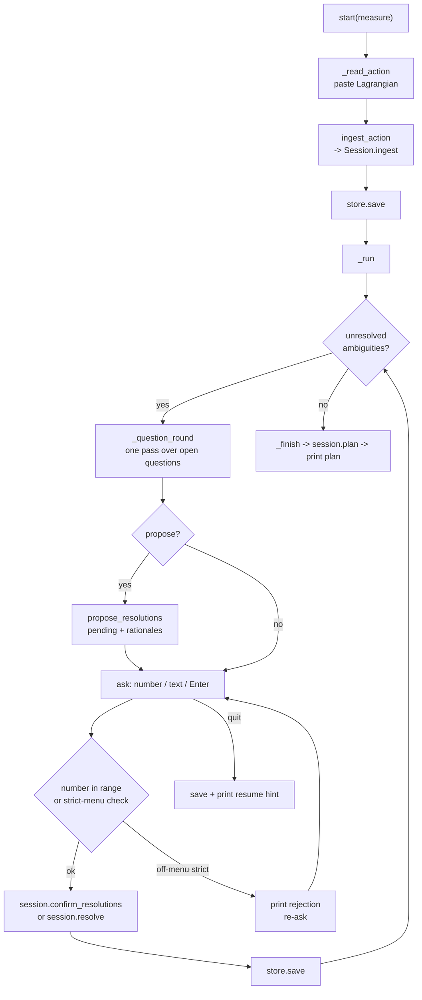

# CLI

Active contributors: KeigoShimadaCC

## Purpose

The `noether` command-line interface is the most direct way to drive the orchestrator loop from a terminal. It has two modes: a set of single-beat subcommands (`ingest`, `elicit`, `kernels`) that expose one step each for scripting, and a conversational `chat` / `resume` loop that walks ingest through plan interactively. The eval subcommands run a full four-beat loop end to end against an audited spec and write a provenance bundle. Every subcommand talks to the same `Session` and `SessionStore` as the HTTP and MCP frontends, so a session started at the terminal resumes through any other surface.

## Directory layout

```
noether/cli/
  main.py   argparse dispatcher, single-beat commands, eval runner
  chat.py   ChatLoop conversational front-end
```

The console script `noether` (declared in `pyproject.toml`) is `python -m noether.cli.main`. Both modules import only the orchestrator and kernel layers; no physics lives here.

## Subcommands

| Subcommand | Handler | What it does |
|---|---|---|
| `kernels` | `cmd_kernels` | List each kernel adapter, its availability, version, and capabilities. |
| `ingest "<L>"` | `cmd_ingest` | Parse a LaTeX action, print the draft NPR (objects, open questions), and report `well_posed`. Never answers a question. |
| `elicit "<L>" [--accept-llm]` | `cmd_elicit` | Ingest, then ask the auto-detected agent CLI to propose answers. Proposals are unconfirmed by default; `--accept-llm` applies on-menu proposals and, if well posed, prints the plan. |
| `serve [--host] [--port] [--store]` | `cmd_serve` | Run the HTTP session API via uvicorn. Requires the `[server]` extra. |
| `mcp [--store]` | `cmd_mcp` | Run the MCP stdio server. Requires the `[mcp]` extra. |
| `chat [--measure] [--store]` | `cmd_chat` | Start a conversational session: paste an action, answer questions, reach a plan. |
| `resume <session_id> [--store]` | `cmd_resume` | Resume a stored session in the chat loop. |
| `sessions [--store]` | `cmd_sessions` | List stored session ids. |
| `eval1` ... `eval5` | `run_eval` | Run the named eval end to end with a provenance bundle. |
| `eval1s`, `eval3s` | `run_eval` | ADM-of-GR and Minkowski-spectrum evals. |
| `eval4ma`, `adm-affine` | `run_eval` | Metric-affine perturbation and metric-affine ADM evals. |
| `vector-affine` | `run_eval` | Vector-on-affine-background eval. |

The eval subcommands are defined by the `EVAL_KEYS` tuple in `main.py` and the `_BUILDERS` map in `evals/registry.py`. Each eval has a declarative `EvalSpec` (NPR, documented elicitation answers, audited Cadabra templates with required checks, presented results with verification ladders). The runner ingests, applies the documented answers, builds the plan, runs the Cadabra kernel if installed (skipped with a note otherwise), runs the SymPy component checks, and writes a `ResultBundle` per presented result under `--results` (default `results/`).

## Key abstractions

| Abstraction | Where | Role |
|---|---|---|
| `ChatLoop` | `noether/cli/chat.py` | Injected-IO conversational loop (input_fn/out) so it is unit-testable without a TTY. |
| `STRICT_MENU_AMBIGUITIES` | `noether/cli/chat.py` | The set of ambiguity ids (connection, torsion, nonmetricity, metric-compatibility, ricci-contraction, field-strength-definition) whose answers must be a listed option, matching HTTP `/resolve`. |
| `_propose` | `noether/cli/chat.py` | Calls `propose_resolutions`, stores pending choices and rationales, and surfaces the model rationale alongside each proposed choice. |
| `run_eval` | `noether/cli/main.py` | Drives an `EvalSpec` through ingest, elicit, plan, compute, verify, and bundle write. |
| `EVAL_KEYS` | `noether/cli/main.py` | Tuple of subcommand names that route to `run_eval`. |
| `CliLLMAdapter` | `noether/llm/cli.py` | Auto-detects an agent CLI (codex, claude, gemini, droid) by subprocess; no API key. |

## How the chat loop works



A round is one pass over the open questions. For each ambiguity the loop prints the numbered options and any pending model proposal with its rationale, then reads an answer. A digit selects the indexed option; `propose` asks the agent CLI for suggestions; an empty line accepts a pending proposal; `skip` leaves the question open; `quit` saves and exits. The human is the authority: free-form text is recorded verbatim for non-strict ambiguities, but the geometry and convention ambiguities in `STRICT_MENU_AMBIGUITIES` reject anything not on the menu, exactly as HTTP `/resolve` does. After every answer the session is saved, so `noether resume <id>` continues from the same store.

`_propose` surfaces the model rationale alongside each proposed choice. Pending choices take effect only when the human accepts each one (empty line at that question), never on proposal. The loop refuses to plan while questions remain: `_run` stops with a "planning would be a guess" message if a full round records no answer, and `_finish` calls `session.plan()` which raises `AmbiguityBlocked` if the ledger is still open.

## Integration points

- **Session store.** `cmd_chat`, `cmd_resume`, `cmd_sessions`, and the eval runner all use `SessionStore` (default directory overridable with `--store`). This is the same store the HTTP and MCP frontends use, so sessions cross surfaces.
- **LLM adapter.** `cmd_elicit` and the chat loop use `CliLLMAdapter`, which auto-detects an agent CLI. Tests inject `StubLLMAdapter` instead; no test reaches a real LLM.
- **Kernel adapters.** `cmd_kernels` and `run_eval` construct `CadabraAdapter` and `SympyKernelAdapter`. Cadabra tests skip cleanly when the kernel is missing.
- **Eval registry.** `run_eval` calls `evals.registry.get_spec(key)` and `component_task` for the SymPy cross-checks. Adding an eval means adding a builder in `evals/registry.py` and its key to `EVAL_KEYS`.

## Entry points for modification

- **Add a subcommand.** Add a subparser in `main()` and a `cmd_*` handler. Return an int exit code.
- **Add an eval.** Add an `EvalSpec` builder in `evals/registry.py`, register it in `_BUILDERS`, and add its key to `EVAL_KEYS` in `main.py`. The runner picks it up automatically.
- **Change chat behavior.** Edit `ChatLoop` in `noether/cli/chat.py`. IO is injected, so add `ScriptedInput` lines in `tests/test_chat.py` to cover new paths.
- **Change the strict-menu set.** Edit `STRICT_MENU_AMBIGUITIES` in `chat.py`; this must stay in sync with the server-side validation in `noether/server/app.py` (`session.confirm_resolutions`).

## Key source files

| File | Role |
|---|---|
| `noether/cli/main.py` | Argparse dispatcher, single-beat commands, `run_eval` |
| `noether/cli/chat.py` | `ChatLoop`, `STRICT_MENU_AMBIGUITIES`, `_propose` |
| `evals/registry.py` | `EvalSpec` builders and `_BUILDERS` map |
| `tests/test_chat.py` | Scripted-IO tests for the chat loop |
| `pyproject.toml` | Declares the `noether` console script |
