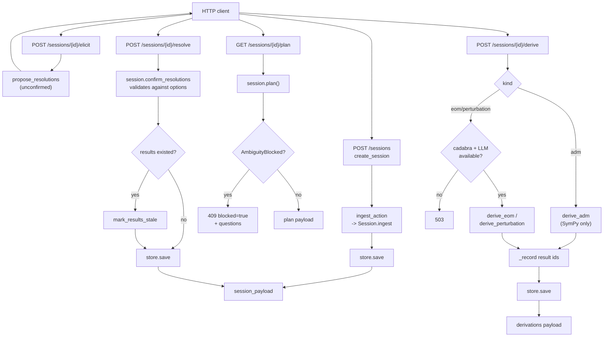

# HTTP server

Active contributors: KeigoShimadaCC

## Purpose

The HTTP server is a thin FastAPI app over the orchestrator session surface. It exposes the ingest, elicit, resolve, definitions, plan, derive, and results beats as JSON endpoints so the web client (and any other HTTP caller) can drive a session without touching Python. The no-guessing contract is enforced server-side exactly as in the library: `/elicit` returns unconfirmed proposals, only `/resolve` with human-confirmed choices validated against the listed options mutates the session, and planning while the ledger is open returns `409` with the question list, never a guess.

## Directory layout

```
noether/server/
  app.py    create_app() factory, routes, request models
  __init__.py  exports create_app
```

The server lives behind the `[server]` extra (`fastapi`, `uvicorn`, `httpx`) so the core package stays lean. Tests in `tests/test_server.py` skip cleanly when the extra is missing.

## Endpoints

| Method | Path | Handler | Returns |
|---|---|---|---|
| `GET` | `/health` | `health` | `{"status": "ok", "kernels": {...}}` with per-kernel availability and version. |
| `GET` | `/sessions` | `list_sessions` | `{"sessions": [id, ...]}`. |
| `POST` | `/sessions` | `create_session` | `201` with a `session_payload` (action, objects, questions, events). `422` on a parse error. |
| `GET` | `/sessions/{id}` | `get_session` | `session_payload`. `404` if unknown. |
| `POST` | `/sessions/{id}/elicit` | `elicit` | Unconfirmed model proposals with rationale. `503` if no LLM backend, `502` on LLM error. |
| `POST` | `/sessions/{id}/resolve` | `resolve` | `session_payload` after applying confirmed resolutions. `404` for an unknown ambiguity id, `400` for an off-menu choice. Marks prior results stale if a resolution lands after results existed. |
| `GET` | `/sessions/{id}/definitions` | `definitions` | Proposed readability shorthands (`F_phi`, etc.); `confirmed: false`. |
| `POST` | `/sessions/{id}/definitions` | `adopt_definitions` | `session_payload` after adopting the named proposals. `404` for an unknown proposal id. |
| `GET` | `/sessions/{id}/plan` | `plan` | `{"task_type", "steps", "verification"}`. `409` with `{"blocked": true, "questions": [...]}` while the ledger is open. |
| `POST` | `/sessions/{id}/derive` | `derive` | `{"session_id", "derivations": [...]}`. `kind=eom\|perturbation\|adm`. `409` while blocked, `422` for an unknown kind or `NotImplementedError`, `503` if cadabra or an LLM backend is missing, `502` on LLM error, `400` for a `with_respect_to` field that is not a declared object. |
| `GET` | `/sessions/{id}/results` | `results` | `results_payload`: derivations reloaded from their provenance bundles plus `stale_result_ids`. |

## Request models

All models are Pydantic `BaseModel` subclasses in `noether/server/app.py`.

| Model | Fields | Used by |
|---|---|---|
| `CreateSessionRequest` | `lagrangian: str`, `measure: str = "d^4x \\sqrt{-g}"` | `POST /sessions` |
| `ResolveRequest` | `resolutions: dict[str, str]` (min length 1) | `POST /sessions/{id}/resolve` |
| `AdoptDefinitionsRequest` | `accept: list[str]` (min length 1) | `POST /sessions/{id}/definitions` |
| `DeriveRequest` | `with_respect_to: list[str] \| None = None`, `kind: str = "eom"` | `POST /sessions/{id}/derive` |

`kind` accepts `"eom"`, `"perturbation"`, or `"adm"`. Anything else returns `422`. For `eom`, `with_respect_to` is copied onto `npr.task.with_respect_to`; each field must be a declared object name or the request returns `400`.

## How it works



`create_app(store, llm, results_root)` builds the app. `store` defaults to `SessionStore(DEFAULT_STORE)`. `llm=None` defers to auto-detecting an agent CLI at request time via `CliLLMAdapter`; tests inject a stub instead. `results_root` defaults to the store's parent directory's `results/` sibling.

`_get_session` raises `404` on an unknown id. `_record` records each derivation's result id into the session (deduped, so a repeat derive does not grow history) and saves. The ADM path (`kind="adm"`) writes no model script and needs only the SymPy component kernel, so it skips the cadabra-availability check. The eom and perturbation paths require both cadabra and an LLM backend; either missing returns `503`.

## Integration points

- **Session store.** `app.state.store` is a `SessionStore`; the same store the CLI and MCP server use. A session created over HTTP is visible to `noether resume <id>` and to the MCP tools.
- **Orchestrator.** Routes call `ingest_action`, `propose_resolutions`, `session.confirm_resolutions`, `session.plan`, `derive_eom`, `derive_perturbation`, `derive_adm`, `propose_definitions`. No physics logic lives in `app.py`.
- **View layer.** `session_payload` and `results_payload` are imported from `noether/orchestrator/view.py`, so the JSON shape is shared with the MCP server.
- **Web frontend.** `frontend/next.config.mjs` rewrites `/api/*` to this server (`NOETHER_API_URL`, default `http://127.0.0.1:8754`). `frontend/lib/api.ts` mirrors the response shapes exactly.

## Running it

```sh
pip install -e ".[server]"
noether serve                    # 127.0.0.1:8754
noether serve --host 0.0.0.0 --port 9000 --store /path/to/sessions
```

`cmd_serve` in `noether/cli/main.py` constructs the app with `create_app(store=store)` and runs it with `uvicorn.run(app, host=args.host, port=args.port)`. The defaults are `127.0.0.1` and `8754`.

## Entry points for modification

- **Add an endpoint.** Add a route inside `create_app` in `noether/server/app.py`; add a Pydantic request model if the body is non-trivial. Mirror the shape in `frontend/lib/api.ts` if the web client should call it.
- **Change validation.** Resolution and definition validation call into `Session` methods (`confirm_resolutions`, `add_definition`); change the contract there, not in the route handler.
- **Change the blocked-plan response.** It is built in the `plan` handler from `AmbiguityBlocked.questions`. The MCP server builds the same shape; keep them in sync.

## Key source files

| File | Role |
|---|---|
| `noether/server/app.py` | `create_app` factory, routes, request models |
| `noether/server/__init__.py` | Exports `create_app` |
| `noether/orchestrator/view.py` | `session_payload`, `results_payload` (shared with MCP) |
| `tests/test_server.py` | TestClient tests for every route, including blocked-plan and off-menu paths |
| `noether/cli/main.py` | `cmd_serve` launcher |
