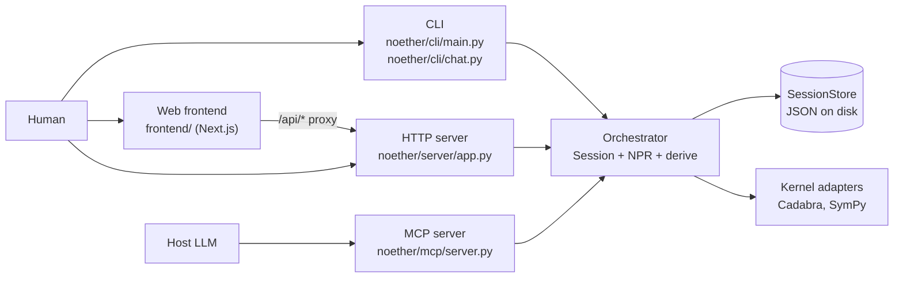

# Apps

Active contributors: KeigoShimadaCC

## Purpose

Noether exposes four frontends over one orchestrator session surface: a command-line interface, an HTTP server, an MCP (Model Context Protocol) server, and a web client. None of them run physics. Each one forwards user input to the same `Session` state machine, the same `SessionStore`, and the same kernel adapters, then renders the response back in its own shape. The two mechanically-enforced promises (no unearned assertions, no silent guessing) are identical on every surface because they live in the orchestrator, not in the frontend.

This page maps the four surfaces to their entry points and states the contract they all share. The per-surface pages follow:

- [CLI](cli.md) for the `noether` console script and the conversational loop.
- [HTTP server](http-server.md) for the FastAPI session API.
- [MCP server](mcp-server.md) for the stdio tool server a host LLM calls.
- [Web frontend](web-frontend.md) for the Next.js client.

## How the surfaces relate

All four frontends construct or load a `Session` from the same `SessionStore` (JSON files under a store directory). A session created by the CLI is visible to `noether serve`, to the MCP tools, and to the web client's stored-sessions list. The orchestrator layer (`noether/orchestrator/`) owns every state transition; the frontends only translate between their wire format and the `Session` API. See [../systems/orchestrator.md](../systems/orchestrator.md) for that layer and [../systems/npr.md](../systems/npr.md) for the problem representation.

## Surface entry points

| Surface | Entry point | Backed by | Optional extra |
|---|---|---|---|
| CLI | `noether` console script, or `python -m noether.cli.main` | `noether/cli/main.py`, `noether/cli/chat.py` | none |
| HTTP server | `noether serve` (uvicorn on `127.0.0.1:8754`) | `noether/server/app.py` (FastAPI) | `[server]` (fastapi, uvicorn, httpx) |
| MCP server | `noether mcp` (stdio) | `noether/mcp/server.py` (FastMCP) | `[mcp]` |
| Web frontend | `cd frontend && npm run dev` | `frontend/` (Next.js App Router) | none (talks to the HTTP server) |

The web frontend has no direct orchestrator dependency. Its `next.config.mjs` rewrites `/api/*` to the FastAPI server (`NOETHER_API_URL`, default `http://127.0.0.1:8754`), so the browser only ever talks to Next and Next proxies to the HTTP surface.

## The no-guessing contract on every surface

The contract is enforced in the orchestrator, so each surface expresses the same refusal in its own idiom. A non-empty ambiguity ledger blocks planning before any derivation runs.

| Surface | While the ledger is open | On an off-menu resolution |
|---|---|---|
| HTTP | `GET /sessions/{id}/plan` returns `409` with `{"blocked": true, "questions": [...]}`. `/derive` returns `409` the same way. | `POST /sessions/{id}/resolve` returns `400` naming the bad choice; the session is unchanged. |
| MCP | `noether_plan` returns `{"blocked": true, "questions": [...]}` as a tool result. `noether_derive` returns the same blocked dict. | `noether_resolve` returns `{"error": ...}` as a tool result; the session is unchanged. |
| CLI | `noether chat` prints the open questions and stops with a "planning would be a guess" message rather than printing a plan. | Numbered geometry answers go through the same menu-validation path as HTTP `/resolve` (see `STRICT_MENU_AMBIGUITIES` in `chat.py`); an off-menu answer to a strict ambiguity is rejected inline. |

Refusals are data, not exceptions, on the MCP surface specifically: a host LLM cannot make Noether guess, and the host can relay the question list to its human. On the HTTP surface the same refusal is an HTTP status code. On the CLI the refusal is a printed message and a non-zero exit. The substance is identical.

## Tasks reachable from every surface

Each surface can reach the three derivation kinds (`eom`, `perturbation`, `adm`) plus the ingest, elicit, resolve, plan, and results beats. The feature pages under [../features/index.md](../features/index.md) describe what each task does and which kernel scaffold backs it; this section only notes the surface shape.

| Beat | CLI | HTTP | MCP | Web |
|---|---|---|---|---|
| Ingest | `noether ingest` or `noether chat` | `POST /sessions` | `noether_ingest` | new-session form on `app/page.tsx` |
| Elicit (propose) | `noether elicit`, or `propose` in chat | `POST /sessions/{id}/elicit` | (host LLM proposes) | "Ask the model to propose" button |
| Resolve | numbered answers in chat | `POST /sessions/{id}/resolve` | `noether_resolve` | option buttons or free-form input |
| Definitions | (chat surfaces them) | `GET`/`POST /sessions/{id}/definitions` | `noether_propose_definitions`, `noether_adopt_definitions` | "Suggested notation" card |
| Plan | printed at the end of chat | `GET /sessions/{id}/plan` | `noether_plan` | plan card |
| Derive | `noether eval{1..5}`, `eval1s`, `eval3s`, `eval4ma`, `adm-affine`, `vector-affine` | `POST /sessions/{id}/derive` (`kind=eom\|perturbation\|adm`) | `noether_derive` | derive buttons in `Workspace.tsx` |
| Results | (eval prints and writes a bundle) | `GET /sessions/{id}/results` | `noether_results` | `DerivationTree` + `ExportPanel` |

## Key source files

| File | Role |
|---|---|
| `noether/cli/main.py` | CLI subcommand dispatcher and eval runner |
| `noether/cli/chat.py` | Conversational `ChatLoop` with menu-validated geometry answers |
| `noether/server/app.py` | FastAPI app factory and request models |
| `noether/mcp/server.py` | `NoetherTools` plus `create_mcp_server` wrapper |
| `frontend/app/page.tsx` | New-session page |
| `frontend/app/sessions/[id]/page.tsx` | Session workspace page |
| `frontend/components/Workspace.tsx` | Workspace component driving the session loop |
| `frontend/lib/api.ts` | Typed client for the HTTP surface |
| `frontend/next.config.mjs` | `/api/*` rewrite to the FastAPI server |

## Entry points for modification

- Add a CLI subcommand: add a subparser in `main()` and a `cmd_*` handler in `noether/cli/main.py`. Eval subcommands are gated by the `EVAL_KEYS` tuple and the `evals/registry.py` builders.
- Add an HTTP endpoint: add a route inside `create_app` in `noether/server/app.py` and a request model if needed.
- Add an MCP tool: add a method to `NoetherTools` and a `@server.tool()` wrapper in `create_mcp_server` in `noether/mcp/server.py`.
- Add a web view: add a route under `frontend/app/` and a component under `frontend/components/`; wire it through `frontend/lib/api.ts`.

See the per-surface pages for the details.
