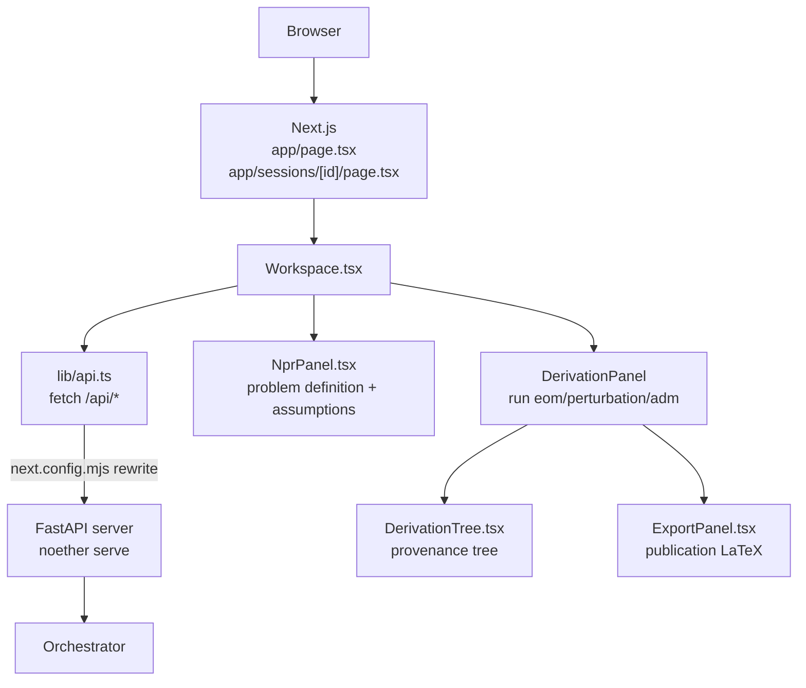

# Web frontend

Active contributors: KeigoShimadaCC

## Purpose

The web frontend is a Next.js client that renders a Noether session in a browser. The browser only ever talks to Next; Next proxies `/api/*` to the FastAPI session server. No physics state lives client-side. The frontend renders the action, the clarifying questions, the plan, the provenance tree for each derivation, and a publication-LaTeX export of the kernel-verified results. Every assumption is visible and clickable, and a late resolution marks prior results stale rather than silently recomputing them.

## Directory layout

```
frontend/
  package.json          scripts: dev, build, start, typecheck, test
  next.config.mjs       /api/* rewrite to the FastAPI server
  tsconfig.json
  jest.config.ts        jest + jsdom + ts-jest
  jest.setup.ts
  app/
    layout.tsx          root layout, KaTeX CSS, topbar
    page.tsx            new-session form + stored-sessions list
    globals.css
    sessions/[id]/
      page.tsx          renders <Workspace sessionId={id} />
  components/
    Workspace.tsx       session loop: questions, plan, derive, results
    DerivationTree.tsx  provenance tree per derivation
    ExportPanel.tsx     publication-LaTeX export of verified results only
    NprPanel.tsx        problem definition, assumptions, history side panel
    Latex.tsx           KaTeX render helper
  lib/
    api.ts              typed client for the HTTP surface
  __tests__/
    DerivationCard.test.tsx
    PerturbationAdmTree.test.tsx
```

## Stack

Next.js 15 (App Router) with React 19 and TypeScript. KaTeX renders LaTeX. Tests run on Jest with `@testing-library/react` and `jest-environment-jsdom`. The `package.json` scripts are `dev` (`next dev`), `build` (`next build`), `start` (`next start`), `typecheck` (`tsc --noEmit`), and `test` (`jest`).

## How it works



`app/page.tsx` is the new-session page. It collects a Lagrangian (and an optional measure), shows a live KaTeX preview, calls `api.createSession`, and pushes to `/sessions/{id}`. It also lists stored sessions from `api.listSessions` so the user can resume any session, including ones created by the CLI or MCP server.

`app/sessions/[id]/page.tsx` is a server component that reads the `id` route param and renders `<Workspace sessionId={id} />`. `Workspace.tsx` is the client component that drives the session loop. On mount it calls `api.getSession`, then `api.plan` (if well posed) and `api.definitions`. It renders open questions as `QuestionCard`s (option buttons, a free-form input, and any model proposal with its rationale), a `NotationCard` for proposed shorthands, a `PlanCard` once well posed, and a `DerivationPanel` with three buttons: equations of motion, expand to quadratic order, and ADM (3+1) split. The side panel is `NprPanel.tsx`, which shows the session state, the action, the objects, every assumption with its resolution and a "change" button, and the event history.

`lib/api.ts` is a typed client. Its interfaces (`SessionPayload`, `Question`, `FieldDerivation`, `PlanPayload`, `BlockedPlan`, `ElicitPayload`, `ResultsPayload`, etc.) mirror `noether/orchestrator/view.py` and `noether/server/app.py` exactly. Every call goes through `request<T>("/api/...")`, which `next.config.mjs` rewrites to `NOETHER_API_URL` (default `http://127.0.0.1:8754`). `ApiError` carries the HTTP status and detail.

## Key abstractions

| Abstraction | File | Role |
|---|---|---|
| `Workspace` | `components/Workspace.tsx` | Top-level client component: loads the session, renders questions, plan, derive panel, side panel. |
| `QuestionCard` | `components/Workspace.tsx` | One clarifying question: option buttons, free-form input, model proposal with rationale. |
| `NotationCard` | `components/Workspace.tsx` | Suggested readability shorthands; adopt button per proposal. |
| `DerivationPanel` | `components/Workspace.tsx` | Runs `eom`/`perturbation`/`adm`, reloads results, renders one `DerivationTree` per derivation plus the `ExportPanel`. |
| `DerivationTree` | `components/DerivationTree.tsx` | Provenance tree: action, plan, kernel script (toggleable), every verification check with a PASS/FAIL badge, conventions block, result with verdict badges, optional teaching panel. |
| `headingFor` | `components/DerivationTree.tsx` | Maps a derivation to its heading (`δS / δφ = 0`, `S₂[φ]`, or the ADM field name). |
| `ExportPanel` | `components/ExportPanel.tsx` | Builds a publication-LaTeX document from kernel-verified, non-stale results only. Copy or download `.tex`. |
| `NprPanel` | `components/NprPanel.tsx` | Side panel: problem definition, objects, assumptions with change buttons, event history. |
| `Latex` | `components/Latex.tsx` | KaTeX `renderToString` with `throwOnError: false`; bad fragments render in red. |
| `api` | `lib/api.ts` | Typed fetch client; interfaces mirror the server shapes. |

## Badges and the verified boundary

`DerivationTree.tsx` renders three verdict badges on each result:

- `kernel-verified` (green) when `d.verified` is true.
- `unverified` (red) when `d.verified` is false. The `detail` field names the blocker so a gated result is distinguishable from a verified one.
- `stale` (amber) when the result id is in `stale_result_ids` from `ResultsPayload`. A late resolution marks prior results stale; they are never silently recomputed.

A `teaching` panel appears when `d.teaching` is non-empty, labeled "(reasoned, not kernel-verified)" so the boundary between kernel output and model narration is visible in the UI. Teaching mutates no NPR and sets no result; it is pure prose.

`ExportPanel.tsx` includes only results that are `verified`, have a `result_tex`, and are not in `staleResultIds`. The generated LaTeX names the convention block (`convention_id`) and emits the load-bearing convention entries as a comment before each equation, so no convention is silently assumed. Unverified and stale results are left out.

## Integration points

- **HTTP server.** All data comes from `/api/*`, proxied to `noether serve`. The frontend has no direct orchestrator or kernel dependency.
- **Session store sharing.** Because the HTTP server shares its `SessionStore` with the CLI and MCP server, the stored-sessions list on `app/page.tsx` shows sessions created by any surface.
- **Conventions.** Each derivation carries its `conventions` map; `DerivationTree` renders it and `ExportPanel` emits it. Changing an elicited convention is reflected in the result without a client-side recompute.
- **Metric-affine derives.** When the session has a connection object, `DerivationPanel` sends the full dynamical field list as `with_respect_to` for EOM derives so both the metric and the connection equation are derived, matching the server's metric-affine behavior.

## Running it

```sh
cd frontend
npm install
npm run dev          # next dev; needs `noether serve` running
npm run build
npm run start
npm run typecheck
npm run test
```

`next.config.mjs` reads `process.env.NOETHER_API_URL` (default `http://127.0.0.1:8754`) and rewrites `/api/:path*` to that origin. Start the FastAPI server with `noether serve` before `npm run dev`.

## Tests

| File | Covers |
|---|---|
| `frontend/__tests__/DerivationCard.test.tsx` | `DerivationTree` rendering: action, plan, kernel script, checks, result, verdict badges, teaching panel, conventions. |
| `frontend/__tests__/PerturbationAdmTree.test.tsx` | Perturbation and ADM provenance trees, stale and unverified badges, LaTeX export boundaries. |

Tests use `@testing-library/react` with jsdom. No test reaches a real API server; responses are mocked against the shapes in `lib/api.ts`.

## Entry points for modification

- **Add a page.** Add a route under `frontend/app/` and a component under `frontend/components/`. Wire data through `frontend/lib/api.ts`, adding an interface that mirrors the server shape.
- **Change the provenance tree.** Edit `components/DerivationTree.tsx`. The `FieldDerivation` interface in `lib/api.ts` is the contract with the server.
- **Change the export.** Edit `components/ExportPanel.tsx`. Keep the rule that only verified, non-stale results are included; the convention block must stay explicit.
- **Add a derivation kind.** Add a button in `DerivationPanel` and a `kind` value accepted by the server's `POST /derive`. Mirror the new shape in `lib/api.ts`.

## Key source files

| File | Role |
|---|---|
| `frontend/app/page.tsx` | New-session page |
| `frontend/app/sessions/[id]/page.tsx` | Session workspace page |
| `frontend/app/layout.tsx` | Root layout, KaTeX CSS, topbar |
| `frontend/components/Workspace.tsx` | Session loop and derive panel |
| `frontend/components/DerivationTree.tsx` | Provenance tree and verdict badges |
| `frontend/components/ExportPanel.tsx` | Publication-LaTeX export |
| `frontend/components/NprPanel.tsx` | Problem definition and assumptions side panel |
| `frontend/components/Latex.tsx` | KaTeX render helper |
| `frontend/lib/api.ts` | Typed HTTP client |
| `frontend/next.config.mjs` | `/api/*` rewrite to `NOETHER_API_URL` |
| `frontend/package.json` | Scripts and dependencies |
