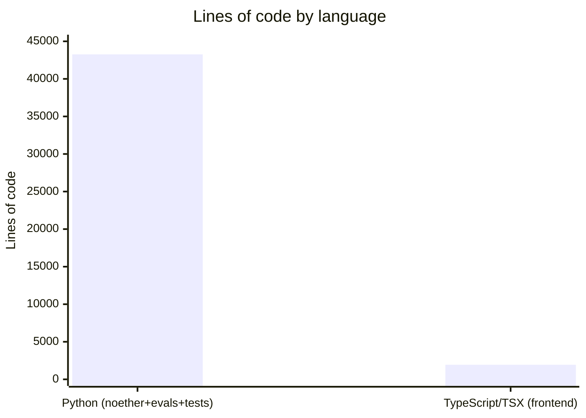

# By the numbers

Data collected on 2026-07-27.

## Size

### Lines of code by language

The codebase is overwhelmingly Python, with a small TypeScript frontend layer on top of the HTTP session API.

| Language | Scope | Lines |
| --- | --- | --- |
| Python | `noether/` + `evals/` + `tests/` | 43,261 |
| TypeScript / TSX | `frontend/` (excludes `node_modules`, `.next`) | 1,943 |

### Files by role

| Role | Count | Scope |
| --- | --- | --- |
| Source files | 51 | `noether/` (`.py`) |
| Test and eval files | 83 | `tests/` + `evals/` (`.py`) |

### Packages and modules

| Package | Type | Subpackages |
| --- | --- | --- |
| `noether` | Python package | `npr`, `kernels`, `orchestrator`, `verify`, `provenance`, `llm`, `server`, `mcp`, `cli` |
| `frontend` | Next.js app | single app over the HTTP session API |

## Activity

### Commits over time

All 112 commits landed in a single month, June 2026, between 2026-06-12 and 2026-06-19. There is no long tail: the repository was written in an eight-day sprint and then went quiet.

| Period | Commits |
| --- | --- |
| 2026-06 | 112 |

Daily breakdown (active days only):

| Date | Commits |
| --- | --- |
| 2026-06-12 | 15 |
| 2026-06-13 | 5 |
| 2026-06-15 | 2 |
| 2026-06-16 | 7 |
| 2026-06-17 | 18 |
| 2026-06-18 | 39 |
| 2026-06-19 | 26 |

That is roughly 16 commits per active day, or about 14 per day averaged over the eight calendar days of the sprint. Activity accelerated sharply toward the end: 2026-06-18 alone accounts for 35% of all commits.

### Most changed files in the last 90 days

Since every commit is inside the 90-day window, this is effectively the all-time churn ranking. The hotspots are the docs and the orchestrator's derive path.

| Times touched | Path |
| --- | --- |
| 71 | `docs/02_TECH_SPEC.md` |
| 48 | `AGENTS.md` |
| 39 | `docs/04_EVALS.md` |
| 30 | `noether/orchestrator/derive.py` |
| 24 | `docs/03_METHODOLOGY.md` |
| 21 | `noether/kernels/cadabra/templates.py` |
| 17 | `tests/test_derive.py` |
| 14 | `noether/kernels/sympy_kernel/geometry.py` |
| 14 | `noether/cli/main.py` |
| 13 | `docs/00_INDEX.md` |
| 12 | `noether/kernels/cadabra/generate.py` |
| 11 | `tests/test_server.py` |
| 10 | `noether/kernels/sympy_kernel/adapter.py` |
| 10 | `noether/kernels/cadabra/curvature.py` |
| 9 | `tests/test_mcp.py` |

## Bot-attributed work

Of the 112 commits, 110 carry the `factory-droid[bot]` co-author trailer in the commit body. This is a co-authorship count, not an authorship count: it records that an AI agent paired on the commit, not that it wrote every line. The remaining two commits have no such trailer.

This number is a lower bound on AI-assisted work. Tool calls and inline edits made during a session leave no trace in the git history, so assistance that did not result in a co-author trailer is invisible to this count. The figure should be read as "at least 110 of 112 commits had AI pairing recorded," not as a precise productivity split.

This page does not report per-contributor statistics or leaderboards, by design. The repository is effectively a solo project, and breaking out individual contributors would not add useful signal.

## Complexity

### Average file size by directory

The kernel subpackages hold the largest files by a wide margin. The Cadabra templates file alone is larger than several entire subpackages.

| Directory | Files | Lines | Avg lines/file |
| --- | --- | --- | --- |
| `noether/kernels/cadabra` | 7 | 5,680 | 811 |
| `noether/kernels/sympy_kernel` | 8 | 5,115 | 639 |
| `tests` | 43 | 21,754 | 505 |
| `noether/orchestrator` | 10 | 3,086 | 308 |
| `noether/cli` | 3 | 671 | 223 |
| `noether/mcp` | 2 | 370 | 185 |
| `noether/server` | 2 | 323 | 161 |
| `noether/npr` | 7 | 1,102 | 157 |
| `evals` | 40 | 4,543 | 113 |
| `noether/verify` | 3 | 195 | 65 |
| `noether/llm` | 3 | 179 | 59 |
| `noether/provenance` | 2 | 111 | 55 |
| `noether/kernels` | 3 | 126 | 42 |

### Largest files

| Lines | Path |
| --- | --- |
| 2,718 | `noether/kernels/cadabra/templates.py` |
| 1,848 | `noether/kernels/sympy_kernel/geometry.py` |
| 1,396 | `noether/orchestrator/derive.py` |
| 1,291 | `noether/kernels/sympy_kernel/adm.py` |
| 1,209 | `noether/kernels/cadabra/curvature.py` |
| 868 | `noether/kernels/cadabra/blocks.py` |
| 656 | `noether/kernels/sympy_kernel/ft_tetrad.py` |
| 533 | `noether/orchestrator/ingest.py` |
| 504 | `noether/npr/parse.py` |
| 440 | `noether/kernels/sympy_kernel/adapter.py` |
| 420 | `noether/cli/main.py` |

### Debt markers

A grep for `TODO`, `FIXME`, and `HACK` across `noether/` returns zero matches. The source tree is unusually clean of explicit debt markers, though that says nothing about implicit debt that was never labeled.
