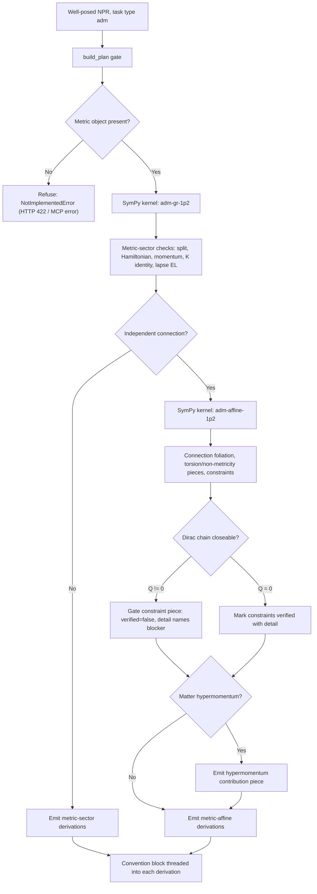

# ADM decomposition

Active contributors: KeigoShimadaCC

## Purpose

Document the `adm` task that decomposes the gravitational sector into its ADM (3+1) form. Unlike `vary` and `perturb`, this path writes no model script: the deliverable is the Gauss-Codazzi split and the normal/tangential projections of the Einstein tensor, universal foliation geometry that the SymPy component kernel verifies on an explicit nondegenerate background. For a metric-affine NPR it additionally exposes the connection's foliation decomposition and constraint structure.

## How it works

`derive_adm` runs the SymPy component kernel twice on a metric-affine NPR: once for the metric sector (`adm-gr-1p2`) and once for the connection sector (`adm-affine-1p2`). Each identity is checked on an explicit 1+2 background, a V2-style falsifier that a wrong tensor relation cannot survive. No Cadabra script is generated.

## Metric sector (GR ADM)

The metric-sector outputs, verified by `adm-gr-1p2`:

- Gauss-Codazzi split of the gravitational Lagrangian:
  `\sqrt{-g}\,R = N\sqrt{h}\left(R^{(3)} + K_{ab}K^{ab} - K^{2}\right) - 2\,\partial_{\mu}(\sqrt{-g}\,v^{\mu})`.
- Hamiltonian (normal-normal) projection: `2\,G_{\mu\nu}\,n^{\mu}n^{\nu} = R^{(3)} + K^{2} - K_{ab}K^{ab}`.
- Momentum (normal-tangential) projection: `G_{\mu i}\,n^{\mu} = D_{a}(K^{a}{}_{i} - \delta^{a}{}_{i}\,K)`.

The kernel confirms the split, both Einstein-tensor projections, the extrinsic-curvature identity, and the lapse Euler-Lagrange equation on an explicit 1+2 background. In vacuum the projection left-hand sides vanish through the Einstein equations, giving the familiar Hamiltonian and momentum constraints; with matter they are sourced by the stress tensor.

## Connection sector (metric-affine ADM)

For an NPR with `geometry.connection.type == "independent"`, `derive_adm` additionally emits pieces verified by `adm-affine-1p2`:

- Connection foliation decomposition: `\Gamma^{\lambda}_{\mu\nu} = \{^{\lambda}_{\mu\nu}\}_g + K^{\lambda}_{\mu\nu}(T) + L^{\lambda}_{\mu\nu}(Q)`, projected into normal and tangential parts.
- Torsion foliation pieces: `T^{i}_{jk}` (spatial), `T^{n}_{jk}` (normal-upper), `T^{i}_{nk}` (mixed).
- Non-metricity foliation pieces: `Q_{ijk}` (spatial), `Q_{nij}` (normal-first), `Q_{inj}` (mixed).
- Extrinsic curvature convention display, derived from the active `K_sign` and `foliation_normal`.
- Connection-sector constraints: primary constraints from the algebraic connection EOM, secondary constraints from the Dirac chain.

## Constraint gating

The connection-sector constraints piece carries a verdict that depends on whether the Dirac chain can close:

- On a metric-compatible (`Q = 0`) torsionful background, the connection EOM is algebraic in the contortion `K` (no derivative-of-`K` terms). Primary constraints come from the algebraic EOM; for pure Palatini Einstein-Hilbert the projective gauge freedom generates first-class constraints and the Dirac chain closes. The piece is verified.
- When non-metricity is present (`Q != 0`), the disformation `L(Q)` introduces additional structure that requires action-specific analysis. The Dirac chain cannot be closed in general, so the constraint piece is gated: `verified=false` with non-empty `detail` naming the blocker. Primary constraints are identified, but secondary constraints and their consistency require further treatment.

## Matter hypermomentum

When the action has matter that couples to the independent connection (nonzero hypermomentum), `derive_adm` emits an additional piece naming the matter contribution:

- `\Delta^{\lambda}_{\mu\nu} = \tau^{\lambda}_{\mu\nu} + \tfrac{1}{n}\delta^{\lambda}_{\mu}\Delta_{\nu} + \sigma^{\lambda}_{\mu\nu}`.
- The spin part `\tau` (antisymmetric, traceless) sources the torsion primary constraint.
- The dilation trace `\Delta_\nu` sources the projective constraint.
- The shear part `\sigma` (symmetric, traceless) sources the non-metricity constraint.

Hypermomentum detection (`_action_has_hypermomentum`): a vector/gauge field with `F = \nabla A` (covariant-curl) has nonzero hypermomentum (`\Delta = -2 A_\lambda F^{\mu\nu}`); a gauge field with `F = dA` has zero hypermomentum; a scalar in `F(\phi) R(\Gamma)` Palatini contributes through the non-constant `F(\phi)` term; pure gravity (only metric and connection) has zero hypermomentum. On a `Q != 0` background the matter piece is gated with the same Dirac-chain blocker.

## Convention threading

Each ADM derivation carries the active convention block (signature, torsion sign, non-metricity definition, Ricci-contraction, contortion sign, disformation sign, `K_sign`, foliation/normal convention, and for metric-affine NPRs the field-strength definition). The extrinsic-curvature convention display is built from the active `K_sign` and `foliation_normal` by `_adm_k_sign_tex`, so an overridden `K_sign` or `foliation_normal` is reflected in `result_tex`. Changing the elicited convention changes the result; no convention is silently assumed.

## Key abstractions and scripts

| Item | Role | Source |
| --- | --- | --- |
| `derive_adm` | Top-level ADM dispatcher; runs the SymPy kernel and assembles derivations | `noether/orchestrator/derive.py` |
| `_ADM_OUTPUTS` | Metric-sector result labels and tex | `noether/orchestrator/derive.py` |
| `_ADM_AFFINE_OUTPUTS` | Connection-sector result labels, tex, and default teaching | `noether/orchestrator/derive.py` |
| `_adm_k_sign_tex` | Build the extrinsic-curvature convention display from the active convention | `noether/orchestrator/derive.py` |
| `_action_has_hypermomentum` | Detect matter coupling to the independent connection | `noether/orchestrator/derive.py` |
| `_convention_block` | Extract the active convention block for each derivation | `noether/orchestrator/derive.py` |
| `_ladder_from_components` | Represent the SymPy component-eval suite as a one-rung V2 ladder | `noether/orchestrator/derive.py` |
| `adm-gr-1p2` / `adm-affine-1p2` | SymPy component kernel checks on a 1+2 background | `noether/kernels/sympy_kernel/adm.py` |
| `Capability.ADM` / `Capability.COMPONENT_EVAL` | Capability tags for ADM and component-eval tasks | `noether/kernels/base.py` |

## Worked-example pointers

- `evals/eval1s_adm.py` (ADM of GR; pytest gate in `evals/test_eval1s.py`).
- `evals/eval_adm_affine.py` (metric-affine ADM; pytest gate in `evals/test_eval_adm_affine.py`).

## Honest limits

- An action with no metric is refused with `NotImplementedError` naming the missing metric object (HTTP 422 / MCP error), rather than guessing a foliation.
- The connection-sector constraints piece is gated when `Q != 0`: the Dirac chain cannot be closed in general. The gate is explicit (`verified=false`, non-empty `detail`), never a synthetic verified result.
- The matter hypermomentum piece is gated on the same `Q != 0` condition.
- The SymPy kernel verifies universal foliation geometry on an explicit background. It does not derive action-specific Hamiltonians; those are out of scope for the `adm` task today.

## Integration points

- [Equations of motion](./equations-of-motion.md) (shares the well-posed gate and convention threading).
- [Metric-affine geometry](./metric-affine-geometry.md) (drives the connection-sector decomposition).
- [Teaching channel](./teaching-channel.md) (ADM teaching narrates torsion/non-metricity foliation pieces and Dirac-chain difficulty).
- [Orchestrator system](../systems/orchestrator.md) (ADM lives here).
- [SymPy kernel system](../systems/kernels/sympy.md) (verifies the split and projections).
- [Verification system](../systems/verification.md) (V2 component-eval rung).
- [Conventions primitive](../primitives/conventions.md) (`K_sign`, `foliation_normal`).

## Entry points for modification

- Extend the metric-sector or connection-sector outputs in `noether/orchestrator/derive.py` (`_ADM_OUTPUTS`, `_ADM_AFFINE_OUTPUTS`).
- Add or refine SymPy component checks in `noether/kernels/sympy_kernel/adm.py`.
- Adjust hypermomentum detection in `_action_has_hypermomentum` when new matter couplings are supported.
- Add eval-backed coverage in `evals/` before exposing new ADM pieces.

## Key source files

| File | Why it matters |
| --- | --- |
| `noether/orchestrator/derive.py` | `derive_adm`, convention threading, constraint gating, hypermomentum detection. |
| `noether/kernels/sympy_kernel/adm.py` | SymPy component checks `adm-gr-1p2` and `adm-affine-1p2`. |
| `noether/npr/conventions.py` | `K_sign` and `foliation_normal` fields threaded into results. |
| `evals/eval1s_adm.py` | GR ADM reference. |
| `evals/eval_adm_affine.py` | Metric-affine ADM reference. |
