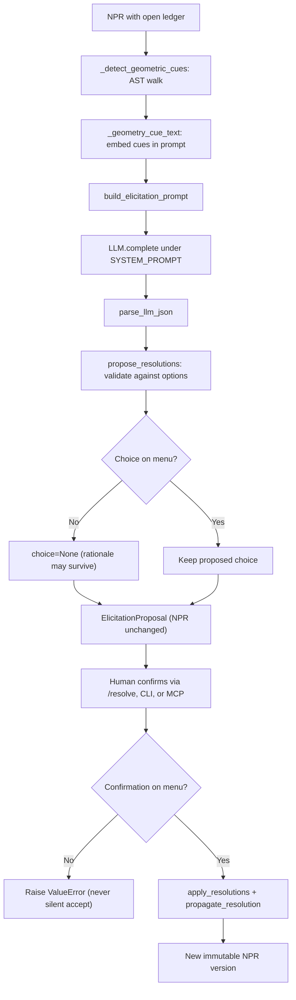

# Elicitation

Active contributors: KeigoShimadaCC

## Purpose

Document the propose-then-confirm dialogue that keeps the no-silent-guessing contract structural. The model proposes an option per open ambiguity; a human confirms or overrides every choice. The model never mutates the NPR and never sets a resolution. Only `apply_resolutions` with on-menu human-confirmed choices produces a new immutable NPR version.

## How it works

`propose_resolutions` is pure suggestion: the returned NPR is unchanged and remains un-plannable. `apply_resolutions` deep-copies the NPR, records each confirmed `Ambiguity.resolution`, and calls `propagate_resolution` to map confirmed answers onto the NPR fields they decide (connection family, Ricci-contraction convention, field-strength definition, `task.with_respect_to`).

## Key abstractions and scripts

| Item | Role | Source |
| --- | --- | --- |
| `propose_resolutions` | Ask the model for one option per open ambiguity; discard off-menu suggestions; return `ElicitationProposal` without mutating the NPR | `noether/orchestrator/elicit.py` |
| `apply_resolutions` | Apply human-confirmed on-menu answers; raise on off-menu or unknown ids; return a new immutable NPR | `noether/orchestrator/elicit.py` |
| `ElicitationProposal` / `ProposedResolution` | Per-ambiguity proposal with `choice` (nullable) and `rationale`, plus model provenance | `noether/orchestrator/elicit.py` |
| `_detect_geometric_cues` | AST walk reading structural cues: curvature `R/G/C/W`, explicit `Gamma`, torsion `T`, non-metricity `Q`, curvature-free cue, `f(Q)`/`f(T)` family | `noether/orchestrator/elicit.py` |
| `UnhandledASTNodeError` | Fail-loud error raised when an AST node type has no match-statement case | `noether/orchestrator/elicit.py` |
| `propagate_resolution` | Map a confirmed answer onto the NPR fields it decides (connection family, Ricci contraction, field-strength definition, task fields) | `noether/orchestrator/resolutions.py` |
| `propose_definitions` | Propose readability shorthands (`F_phi`, `K(T)`, `L(Q)`, `Q` scalar); adoption is the human's call via `Session.add_definition` | `noether/orchestrator/definitions.py` |

## The geometry inference contract

The contract is enforced in code and tested in `tests/test_geometry_inference.py`:

- `propose_resolutions` returns one `ProposedResolution` per open geometry ambiguity.
- Every non-null `choice` is in that ambiguity's `options`.
- Off-menu suggestions yield `choice=None`; the `rationale` may survive.
- Proposing never mutates the NPR. Only `apply_resolutions` with an on-menu choice mutates `geometry.connection` (and derived fields).
- Off-menu and unknown-id confirmations raise `ValueError`, never a silent acceptance.
- The HTTP `/elicit` surface returns `confirmed=false` with proposals (off-menu nulled); `/resolve` enforces the menu (HTTP 400 on off-menu).
- The contract is driven deterministically with `StubLLMAdapter`.

## Geometric cues grounded in the action

`_detect_geometric_cues` walks the action AST so proposals are grounded in the action's actual content, not a fixed default (VAL-GUIDE-017). Detected cues:

- `has_curvature`: any of `R`, `G`, `C`, `W`.
- `has_connection`: an explicit `Gamma` tensor or a non-metric `\nabla` connection annotation.
- `has_torsion`: `T`.
- `has_nonmetricity`: `Q`.
- `has_curvature_free_cue`: `T` or `Q` present and `R` absent (teleparallel or symmetric-teleparallel).
- `has_fq_family` / `has_ft_family`: a function with `Q` or `T` as argument (`f(Q)`, `V(T)`).

`_geometry_cue_text` renders these cues into the inference prompt. A scalar action carries no cue, so the cue text is empty and the model's proposal is not grounded in geometry.

## Fail-loud AST handling

`_detect_geometric_cues` uses a `match` statement covering every current `Expr` node type (`Num`, `Sym`, `Func`, `Tensor`, `Deriv`, `Pow`, `Prod`, `Sum`). Adding a new node type to `noether/npr/ast.py` without adding a corresponding case raises `UnhandledASTNodeError` at runtime. This is fail-loud by design: no silent skip. The fix is to add the case.

## Convention proposals

Convention ambiguities are on-menu with rationale and never auto-applied (VAL-GUIDE-020):

- `amb-ricci-contraction`: opens for an independent connection because Ricci is then non-symmetric. Options are `first-third` (`R_{\mu\nu} = R^\lambda{}_{\mu\lambda\nu}`) and `first-fourth` (`R_{\mu\nu} = R^\lambda{}_{\mu\nu\lambda}`). The active choice is reflected in derivation results.
- `amb-field-strength-definition`: opens when a vector or gauge potential exists on an independent-connection background. Options are `exterior-derivative` (`F = 2\partial_{[\mu}A_{\nu]}`, the `dA` form) and `covariant-curl` (`F = 2\nabla_{[\mu}A_{\nu]}`). The two differ by `T^\lambda{}_{\mu\nu} A_\lambda` under torsion.

## Readability definitions

`propose_definitions` (in `noether/orchestrator/definitions.py`) proposes derivative shorthands for each non-constant function coupling: the first and second derivative in each argument, plus mixed second derivatives for multi-argument couplings such as `K(\phi, X)`. On metric-affine, teleparallel, and symmetric-teleparallel NPRs it also proposes `K(T)` (contortion), `L(Q)` (disformation), the `Q` non-metricity scalar, and the `T` torsion scalar. These are definitions, not computed results: nothing here claims what a variation evaluates to. Adoption is the human's call through `Session.add_definition`, which applies only accepted proposals as a new immutable NPR version. Already-declared symbols are never re-proposed, so repeated calls converge.

## Surfaces

| Surface | Propose | Confirm |
| --- | --- | --- |
| HTTP | `POST /sessions/{id}/elicit` returns proposals with `confirmed=false` | `POST /sessions/{id}/resolve` enforces the menu (400 on off-menu) |
| CLI | `noether chat` / `noether elicit` surfaces proposals with rationale | Numbered answers go through the same menu-validation path before the session store is updated |
| MCP | `noether_elicit` returns proposals | `noether_resolve` enforces the menu |

## Worked-example pointers

- `tests/test_geometry_inference.py` (propose/apply contract, off-menu nulled, HTTP enforcement).
- `tests/test_elicit.py` (prompt mentions every question, proposing resolves nothing, off-menu discarded, provenance recorded, confirmations unblock planning, off-menu confirmation rejected).
- `evals/eval2_palatini.py` (independent connection opens Ricci-contraction question).
- `evals/eval_vector_affine.py` (field-strength definition question).

## Honest limits

- The model's rationale is surfaced for the user but carries no authority: a persuasive rationale does not mutate the NPR.
- Convention proposals are never auto-applied. Even when only one option is physically sensible, the human must confirm.
- `_detect_geometric_cues` is structural; it cannot infer intent. A scalar action with `X` carries no geometry cue and defaults to Levi-Civita until a human says otherwise.
- Proposing does not close the ledger. Planning stays blocked until `apply_resolutions` runs.

## Integration points

- [Ingest](./ingest.md) (produces the ledger elicitation resolves).
- [Equations of motion](./equations-of-motion.md) (downstream of a resolved NPR).
- [Teaching channel](./teaching-channel.md) (teaching mutates no NPR, like proposing).
- [Orchestrator system](../systems/orchestrator.md) (elicit lives here).
- [NPR system](../systems/npr.md) (immutable versioning on resolve).
- [Conventions primitive](../primitives/conventions.md) (convention proposals).
- [CLI app](../apps/cli.md), [HTTP server](../apps/http-server.md), [MCP server](../apps/mcp-server.md) (entry points).

## Entry points for modification

- Extend `_detect_geometric_cues` and `_geometry_cue_text` in `noether/orchestrator/elicit.py`; any new AST node type must add a match case or raise `UnhandledASTNodeError`.
- Extend `propagate_resolution` in `noether/orchestrator/resolutions.py` when a new ambiguity kind carries task semantics.
- Add readability shorthands in `noether/orchestrator/definitions.py`.
- Keep `tests/test_geometry_inference.py` and `tests/test_elicit.py` green when changing the contract.

## Key source files

| File | Why it matters |
| --- | --- |
| `noether/orchestrator/elicit.py` | Propose/apply contract, geometric cue detection, prompt construction. |
| `noether/orchestrator/resolutions.py` | Maps confirmed answers onto NPR fields and connection family. |
| `noether/orchestrator/definitions.py` | Readability shorthand proposals. |
| `noether/npr/schema.py` | `Ambiguity`, `NPR.unresolved_ambiguities`, `NPR.is_well_posed`. |
| `tests/test_geometry_inference.py` | Geometry inference contract tests. |
| `tests/test_elicit.py` | Propose/apply contract tests. |
