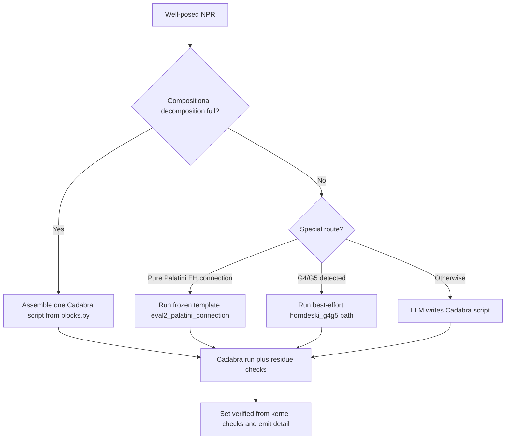

# Equations of motion

Active contributors: KeigoShimadaCC

## Purpose

Describe the `vary` task pipeline that derives equations of motion (EOM) while preserving the no-unearned-assertion contract: the model may write scripts, but only kernel checks set `verified`.

## How it works

## Key abstractions and scripts

| Item | Role | Source |
| --- | --- | --- |
| `derive_field` | Main EOM dispatcher and gatekeeper | `noether/orchestrator/derive.py` |
| `derive_eom` | Runs field-by-field EOM derivations for the active NPR | `noether/orchestrator/derive.py` |
| `generate_script` | General LLM-written Cadabra script path | `noether/kernels/cadabra/generate.py` |
| `decompose_scalar` / `decompose_metric` | Detect full additive decompositions | `noether/kernels/cadabra/blocks.py` |
| `assemble_scalar_eom_script` / `assemble_metric_eom_script` | Build one script carrying real action plus independent candidate | `noether/kernels/cadabra/blocks.py` |
| `attempt_g4g5_eom` | Best-effort held-out Horndeski path with honest gating | `noether/orchestrator/derive.py`, `noether/kernels/cadabra/horndeski_g4g5.py` |

## Variation classes covered

- Scalar field (`kind="scalar-field"`, typically `wrt="phi"`).
- Metric (`kind="metric"`, typically `wrt="g"`).
- Independent connection (`kind="connection"`), using `Capability.INDEPENDENT_CONNECTION`.
- Gauge or vector potential represented as `tensor-field` objects in the vary path.

When geometry is independent-connection, `derive_eom` includes connection objects in its default field list.

## Compositional no-template path

When a Lagrangian fully decomposes into registered additive blocks, Noether skips model script generation and assembles one Cadabra script that residue-checks the whole action against an independently assembled candidate equation.

Registered blocks include:

- canonical kinetic
- potential
- cubic Galileon `G(phi) box phi` (Horndeski G3)
- k-essence `K(phi, X)` (Horndeski G2)
- nonminimal coupling `F(phi) R`
- Einstein-Hilbert `R` (metric sector)

This covers full nonminimal scalar-tensor and cubic Galileon theories for both scalar and metric EOM (`eval7`, `eval8`, `eval6` families).

## Worked-example pointers

- `evals/eval6_cubic_galileon.py`
- `evals/eval7_kessence.py`
- `evals/eval8_nonminimal.py`
- `evals/eval2_palatini.py`

## Honest limits

- Higher Horndeski `G4(phi, X) R` and `G5` are held out of the compositional closure.
- On detection, `derive_field` routes to `attempt_g4g5_eom`, which returns an honest gated result when full closure is not possible.
- The gate is explicit: `verified=false` with non-empty `detail` naming the blocker (`SortCovDs` normal-ordering blocker), never a synthetic verified result.

## Integration points

- [Metric-affine geometry](./metric-affine-geometry.md)
- [Teleparallel gravity](./teleparallel.md)
- [Perturbation](./perturbation.md)
- [Orchestrator system](../systems/orchestrator.md)
- [Cadabra kernel system](../systems/kernels/cadabra.md)
- [Verification system](../systems/verification.md)

## Entry points for modification

- Add or refine block matching and assembly in `noether/kernels/cadabra/blocks.py`.
- Adjust special routing and gating logic in `noether/orchestrator/derive.py`.
- Extend or constrain script generation prompts in `noether/kernels/cadabra/generate.py`.
- Add eval-backed coverage in `evals/` before exposing new EOM classes.

## Key source files

| File | Why it matters |
| --- | --- |
| `noether/orchestrator/derive.py` | Dispatch between compositional, template, and generated-script paths; sets verification semantics. |
| `noether/kernels/cadabra/blocks.py` | Block registry and one-script residue-check assembly for scalar and metric EOM. |
| `noether/kernels/cadabra/generate.py` | LLM script-generation path for unsupported decompositions. |
| `noether/kernels/cadabra/horndeski_g4g5.py` | Held-out Horndeski best-effort scripts and diagnostics. |
| `evals/eval6_cubic_galileon.py` | Cubic Galileon reference. |
| `evals/eval7_kessence.py` | k-essence compositional reference. |
| `evals/eval8_nonminimal.py` | Nonminimal scalar-tensor compositional reference. |
