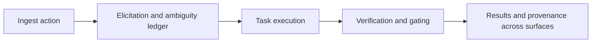

# Features

Active contributors: KeigoShimadaCC

## Purpose

Map the user-facing capabilities that turn an ambiguous LaTeX action into kernel-verified derivations and reproducible provenance across the HTTP API, MCP tools, and web app.

## How it works

## Capability map

| Capability | Primary task type(s) | What it returns | Feature page |
| --- | --- | --- | --- |
| Ingest | `vary`, `perturb`, `adm`, `reduce`, `identity-check` setup | Draft NPR plus ambiguity ledger | [Ingest](./ingest.md) |
| Elicitation | all task types | Human-confirmed geometry, conventions, and field roles | [Elicitation](./elicitation.md) |
| Equations of motion | `vary` | Kernel-checked field equations per `with_respect_to` field | [Equations of motion](./equations-of-motion.md) |
| Metric-affine geometry | cross-cutting | Independent-connection semantics, conventions, and gates | [Metric-affine geometry](./metric-affine-geometry.md) |
| Teleparallel gravity | `vary` | `f(T)` and `f(Q)` field-equation paths with SymPy cross-checks | [Teleparallel gravity](./teleparallel.md) |
| Perturbation | `perturb` | Quadratic action plus linearized EOM consistency checks | [Perturbation](./perturbation.md) |
| ADM decomposition | `adm` | 3+1 decomposition and constraint/evolution structure | [ADM decomposition](./adm-decomposition.md) |
| Teaching channel | cross-cutting | Explanatory prose separate from verification verdict | [Teaching channel](./teaching-channel.md) |

## Task types and execution surfaces

| Axis | Values | Notes |
| --- | --- | --- |
| NPR task types | `vary`, `perturb`, `adm`, `reduce`, `identity-check` | Defined in `noether/npr/schema.py` (`Task.type`). |
| Derivation kinds exposed on surfaces today | `eom`, `perturbation`, `adm` | Accepted by `POST /sessions/{id}/derive` and `noether_derive`. |
| Surfaces | HTTP server, MCP server, web frontend | HTTP: `noether/server/app.py`; MCP: `noether/mcp/server.py`; web API client/UI: `frontend/lib/api.ts`, `frontend/components/Workspace.tsx`. |

## Key abstractions and scripts

| Abstraction | Role | Source |
| --- | --- | --- |
| `NPR` | Session state: geometry, objects, action AST, task, ambiguities | `noether/npr/schema.py` |
| `Task.type` | Declares requested operation class (`vary`, `perturb`, `adm`, `reduce`, `identity-check`) | `noether/npr/schema.py` |
| `derive_field` / `derive_eom` / `derive_perturbation` / `derive_adm` | Orchestrator compute entry points | `noether/orchestrator/derive.py` |
| Cadabra templates and compositional scripts | Kernel compute scripts for EOM/perturbation paths | `noether/kernels/cadabra/templates.py`, `noether/kernels/cadabra/blocks.py` |
| SymPy component oracles | Independent cross-checks and ADM verification | `noether/kernels/sympy_kernel/geometry.py`, `noether/kernels/sympy_kernel/adm.py` |

## Worked-example pointers

- `evals/eval2_palatini.py` (Palatini metric and connection EOM).
- `evals/eval6_cubic_galileon.py` (cubic Galileon path).
- `evals/eval7_kessence.py` (k-essence composition).
- `evals/eval8_nonminimal.py` (nonminimal scalar-tensor, both EOMs).
- `evals/eval_ft_teleparallel.py` and `evals/eval_fq_symmetric_teleparallel.py` (teleparallel families).
- `evals/eval_vector_affine.py` (field-strength choice on torsionful backgrounds).

## Honest limits

- `reduce` and `identity-check` exist in the NPR task schema, but derive surfaces currently expose only `eom`, `perturbation`, and `adm`.
- For any derive kind, verification is kernel-gated. A failed or blocked check returns `verified=false` with non-empty `detail`, never a fabricated success.
- Ambiguities block planning and derivation until resolved.

## Integration points

- [Orchestrator system page](../systems/orchestrator.md)
- [Cadabra kernel system page](../systems/kernels/cadabra.md)
- [SymPy kernel system page](../systems/kernels/sympy.md)
- [Verification system page](../systems/verification.md)
- [Conventions primitive page](../primitives/conventions.md)
- [Expression AST primitive page](../primitives/expression-ast.md)

## Entry points for modification

- Add or change feature behavior in `noether/orchestrator/derive.py` and associated kernel adapters.
- Add new eval coverage in `evals/` before widening exposed capabilities.
- Update frontend triggers and labels in `frontend/components/Workspace.tsx`.

## Key source files

| File | Why it matters |
| --- | --- |
| `noether/npr/schema.py` | Defines canonical task types and connection model. |
| `noether/orchestrator/derive.py` | Main derive dispatch, gating, and persistence logic. |
| `noether/server/app.py` | HTTP `derive` and `results` endpoints. |
| `noether/mcp/server.py` | MCP tool surface (`noether_derive`, `noether_results`). |
| `frontend/lib/api.ts` | Web client request contract for derive/results. |
| `frontend/components/Workspace.tsx` | Web UI buttons and derive flow wiring. |
