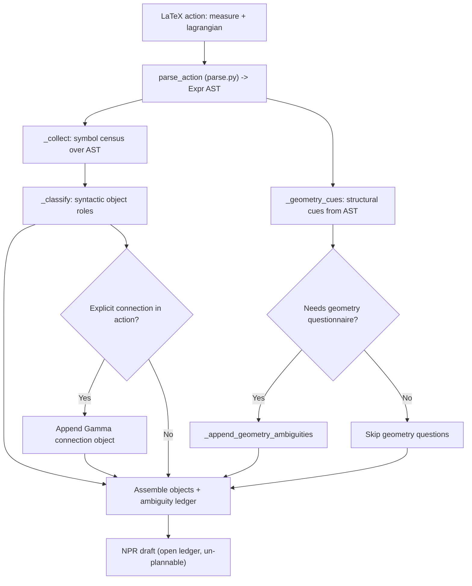

# Ingest

Active contributors: KeigoShimadaCC

## Purpose

Document the ingest stage that turns a raw LaTeX action into a draft NPR with an open ambiguity ledger. Ingest is the semantic half of the INGEST beat on top of the purely syntactic parser (`noether/npr/parse.py`); it classifies symbols syntactically and emits every physics choice as an open question, never assigning meaning. A freshly ingested NPR is intentionally un-plannable: `build_plan()` raises `AmbiguityBlocked` until a human resolves the ledger.

## How it works

Ingest never decides field roles, fields to vary, curvature/connection interpretation of composite symbols, coupling-vs-constant status of functions, dimension, or conventions. All of these become entries in the ambiguity ledger, so the resulting NPR is well-formed but never well-posed until elicitation closes the ledger.

## Key abstractions and scripts

| Item | Role | Source |
| --- | --- | --- |
| `ingest_action` | Top-level entry: measure + lagrangian -> `IngestResult` | `noether/orchestrator/ingest.py` |
| `IngestResult` | Holds the draft `NPR`, the parsed `Expr` lagrangian, object names, and question strings | `noether/orchestrator/ingest.py` |
| `parse_action` / `tokenize` | Purely syntactic LaTeX -> `Expr` AST (`Num`, `Sym`, `Func`, `Tensor`, `Deriv`, `Pow`, `Prod`, `Sum`); preserves a trailing `(\Gamma)` connection annotation on curvature tensors | `noether/npr/parse.py` |
| `_collect` | AST walk census: per symbol records max rank, scalar/indexed/func usage, differentiation, function args | `noether/orchestrator/ingest.py` |
| `_classify` | Syntactic classification only: metric, shorthand, function, tensor-field, scalar-field; roles are provisional placeholders | `noether/orchestrator/ingest.py` |
| `_geometry_cues` | Detects curvature, explicit connection, torsion `T`, non-metricity `Q`, and curvature-free cue (`T` or `Q` present, `R` absent) | `noether/orchestrator/ingest.py` |
| `_append_geometry_ambiguities` | Emits connection, torsion, non-metricity, metric-compatibility, and curvature-free questions with cue-ordered options | `noether/orchestrator/ingest.py` |
| `_recognize_kinetic_scalar` | Reclassifies a bare `X` as the `noether-default-v1` kinetic shorthand when exactly one dynamical scalar is present; still puts the reading to the human as `amb-kinetic-X` | `noether/orchestrator/ingest.py` |
| `_measure_dimension` | Pulls the dimension out of `d^4x` or `d^Dx`; non-4 measures raise an `amb-dimension` question | `noether/orchestrator/ingest.py` |

## What ingest emits

The ambiguity ledger always includes:

- `amb-conventions`: `noether-default-v1` vs custom convention block.
- `amb-vary-wrt`: which field(s) to vary, drawn from declared dynamical objects; when both `g` and `Gamma` are present a compound `g and Gamma` option is offered first for Palatini-style users.
- `amb-coupling-{name}` for each declared function: arbitrary function or fixed constant.
- `amb-composite-{G,C,W}` when a composite curvature shorthand appears: standard curvature combination or independent field.
- `amb-kinetic-X` when `X` is read as the canonical kinetic scalar of a single dynamical scalar field.
- The geometry questionnaire (`amb-connection`, `amb-torsion`, `amb-nonmetricity`, `amb-metric-compatibility`, `amb-curvature-free`) only when the action carries curvature, an explicit connection, torsion, or non-metricity. A pure scalar action carries no geometry cue and defaults to Levi-Civita.
- `amb-dimension` when the measure is not `d^4x`.

Provisional `ObjectDecl` roles are placeholders only and carry no authority while the ledger is open.

## Explicit connection handling

When the action carries an explicit connection (for example `R_{\mu\nu}(\Gamma)`), ingest appends a `Gamma` object with `kind="connection"`, `role="dynamical"`, `rank=3`. The name matches the parser's `_parse_connection_annotation` and `Geometry.connection_name`, both of which default to `Gamma`. This lets the derive path include `Gamma` in `with_respect_to` and route connection variation to the connection-variation worked example rather than the metric one.

## Kinetic shorthand

The canonical kinetic scalar `X = -\tfrac12 \nabla_\mu \phi \nabla^\mu \phi` (`noether-default-v1`) is recognized conservatively: `X` must appear only as a plain scalar (never indexed, differentiated, or called) and exactly one other dynamical scalar must be present. When the conditions hold, `X` is reclassified as a shorthand with a `definition_tex`, so it is not silently offered as a field to vary. The reading is still surfaced to the human as `amb-kinetic-X`.

## Worked-example pointers

- `evals/eval1_eh_trace.py` (Einstein-Hilbert, `G` composite question).
- `evals/eval2_palatini.py` (explicit connection, `R_{\mu\nu}(\Gamma)`).
- `evals/eval3_scalar_tensor.py` (functions and scalar, coupling questions).
- `evals/eval4_maxwell.py` (field strength as tensor-field).
- `evals/eval5_gauss_bonnet.py` (symbolic `d^Dx` measure, dimension question).
- `evals/eval_fq_symmetric_teleparallel.py`, `evals/eval_ft_teleparallel.py` (curvature-free cue from `T`/`Q`).

## Honest limits

- Ingest is conservative by construction: it never assigns physics meaning. A bare `R` raises the full geometry questionnaire rather than assuming Levi-Civita.
- Composite curvature shorthands (`G`, `C`, `W`) are classified as shorthands but their interpretation is left open as `amb-composite-{name}`.
- The parser supports a documented LaTeX subset (see `noether/npr/parse.py`); anything outside that grammar raises `ParseError` rather than guessing.
- V0 structural validation is the only check at ingest time. Physics verification happens later in the derive and verification stages.

## Integration points

- [Elicitation](./elicitation.md) (resolves the ledger ingest emits).
- [Equations of motion](./equations-of-motion.md) (downstream consumer once resolved).
- [Orchestrator system](../systems/orchestrator.md) (ingest lives here).
- [NPR system](../systems/npr.md) (the schema ingest populates).
- [Expression AST primitive](../primitives/expression-ast.md) (the AST ingest classifies).
- [Conventions primitive](../primitives/conventions.md) (the default block ingest threads).
- [CLI app](../apps/cli.md), [HTTP server](../apps/http-server.md), [MCP server](../apps/mcp-server.md) (entry points).

## Entry points for modification

- Extend symbol classification or cue detection in `noether/orchestrator/ingest.py`.
- Extend the LaTeX grammar in `noether/npr/parse.py`; any new AST node type must also be handled in `elicit._detect_geometric_cues` (see [Elicitation](./elicitation.md)) or it raises `UnhandledASTNodeError`.
- Add new ambiguity kinds in `noether/npr/schema.py` and propagation in `noether/orchestrator/resolutions.py`.
- Add eval-backed coverage in `evals/` before exposing new ingest classifications.

## Key source files

| File | Why it matters |
| --- | --- |
| `noether/orchestrator/ingest.py` | Object discovery and ambiguity ledger construction. |
| `noether/npr/parse.py` | Syntactic LaTeX to `Expr` AST; connection annotation preservation. |
| `noether/npr/schema.py` | `NPR`, `ObjectDecl`, `Ambiguity`, `Geometry`, `ConnectionSpec` models. |
| `noether/npr/conventions.py` | `Conventions` model and `NOETHER_DEFAULT_V1` defaults threaded into the draft NPR. |
| `tests/test_ingest.py` | Ledger content and blocking contract tests across all evals. |
