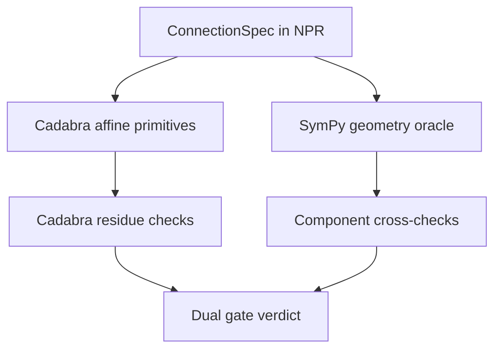

# Metric-affine geometry

Active contributors: KeigoShimadaCC

## Purpose

Define how Noether represents and computes with a general affine connection, including torsion `T`, non-metricity `Q`, and geometry-family constraints, without silently collapsing to Levi-Civita shortcuts.

## How it works

## Connection model

`ConnectionSpec` (`noether/npr/schema.py`) carries:

- `type`: `levi-civita` or `independent`
- `torsion`: `bool`
- `nonmetricity`: `bool`
- `metric_compatible`: `bool`
- `curvature_free`: `bool`
- `family`: `riemannian`, `metric-affine`, `riemann-cartan`, `teleparallel`, `symmetric-teleparallel`

This model lets ingest/elicit distinguish ordinary Levi-Civita setups from metric-affine, Einstein-Cartan, teleparallel, and symmetric-teleparallel regimes.

## Post-Riemannian decomposition

Core decomposition (implemented in `noether/kernels/cadabra/curvature.py`):

`Gamma = LC(g) + K(T) + L(Q)`

- `K(T)` is contortion (torsion-dependent part).
- `L(Q)` is disformation (non-metricity-dependent part).

`curvature.py` provides affine commutators, modified Bianchi identities, torsion and non-metricity irreducible decompositions, and hypermomentum decompositions used by connection-sector scripts.

## Palatini, projective mode, and Einstein-Cartan

- Pure Palatini Einstein-Hilbert connection variation routes to the frozen `eval2_palatini_connection` template path, not the generic model script path.
- Verified solution class is projective:
  `Gamma^lambda_{mu nu} = LC^lambda_{mu nu}(g) + delta^lambda_nu A_mu`, with `A_mu` arbitrary.
- The connection is therefore not uniquely fixed. This is surfaced explicitly in `detail` and result text.

Einstein-Cartan (metric-compatible, torsionful) is treated as the `Q=0` specialization where torsion is sourced algebraically by spin (hypermomentum antisymmetric part). Hypermomentum split helpers (spin, dilation, shear, reconstruction checks) live in both Cadabra primitives and SymPy oracle utilities.

## Field-strength choice under torsion

On independent-connection backgrounds with vector fields, elicitation asks for:

- `F = dA` (`exterior-derivative`)
- `F = nabla A` (`covariant-curl`)

They differ by a torsion term:

`F(covariant-curl) = F(exterior-derivative) - T^lambda_{mu nu} A_lambda`

So this is a load-bearing convention choice, not formatting.

## Dual gate and torsion trap

- Cadabra residue checks alone can miss affine-signature mistakes if a Levi-Civita identity is reused where torsion/non-metricity is active.
- SymPy component oracles in `noether/kernels/sympy_kernel/geometry.py` provide independent general-connection checks (including modified Bianchi identities and affine identities).
- Final trust is the dual gate: Cadabra residue plus SymPy component agreement. This blocks the torsion trap.

## Key abstractions and scripts

| Item | Role | Source |
| --- | --- | --- |
| `ConnectionSpec` / `Geometry` | Canonical geometry declaration in NPR | `noether/npr/schema.py` |
| Convention fields (`torsion_sign`, `nonmetricity_definition`, `contortion_sign`, `disformation_sign`, `ricci_contraction`, `field_strength_definition`) | Explicit metric-affine sign and definition control | `noether/npr/conventions.py` |
| Affine Cadabra primitives | Decomposition, affine identities, hypermomentum, Einstein-Cartan helpers | `noether/kernels/cadabra/curvature.py` |
| SymPy affine oracle | Independent component-level checks and random explicit backgrounds | `noether/kernels/sympy_kernel/geometry.py` |

## Worked-example pointers

- `evals/eval2_palatini.py` (projective-family Palatini solution path).
- `evals/eval_vector_affine.py` (field-strength-definition split under torsion).
- `docs/02_TECH_SPEC.md` sections 6.2, 6.3, 6.5 (metric-affine EOM, Einstein-Cartan, ADM-affine implications).

## Honest limits

- Connection variation is not uniquely solved in pure Palatini EH; only a projective equivalence class is fixed.
- Choosing affine-incorrect identities can create false zeros, so affine derivations are gated behind the dual-check model.
- Some affine perturbation subpaths remain explicitly gated where algebra tooling still has known blockers.

## Integration points

- [Equations of motion](./equations-of-motion.md)
- [Teleparallel gravity](./teleparallel.md)
- [Perturbation](./perturbation.md)
- [ADM decomposition](./adm-decomposition.md)
- [Conventions](../primitives/conventions.md)
- [SymPy kernel system](../systems/kernels/sympy.md)
- [Cadabra kernel system](../systems/kernels/cadabra.md)
- [Verification system](../systems/verification.md)

## Entry points for modification

- Geometry schema evolution: `noether/npr/schema.py`.
- Convention additions/changes: `noether/npr/conventions.py`.
- Affine symbolic primitives and connection-sector helper identities: `noether/kernels/cadabra/curvature.py`.
- Independent numeric/oracle checks and dual-gate diagnostics: `noether/kernels/sympy_kernel/geometry.py`.

## Key source files

| File | Why it matters |
| --- | --- |
| `noether/npr/schema.py` | Defines `ConnectionSpec`, `Geometry`, and family tags. |
| `noether/npr/conventions.py` | Defines explicit metric-affine convention fields. |
| `noether/kernels/cadabra/curvature.py` | Core affine symbolic toolkit, including `Gamma = LC + K + L` and hypermomentum pieces. |
| `noether/kernels/sympy_kernel/geometry.py` | General-connection component oracle and cross-check utilities. |
| `evals/eval2_palatini.py` | Ground truth for projective-mode Palatini behavior. |
| `evals/eval_vector_affine.py` | Ground truth for `F=dA` vs `F=nabla A` under torsion. |
