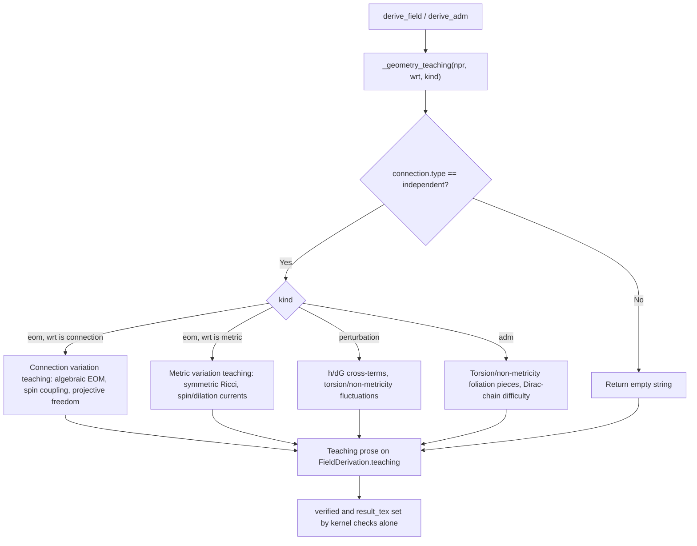

# Teaching channel

Active contributors: KeigoShimadaCC

## Purpose

Document the teaching narration channel on `FieldDerivation`. Teaching is pure prose that explains what the user's geometric choices imply for a derivation. It is distinct from the verdict `detail` and from `result_tex`, reasoned rather than kernel-verified, and it mutates no NPR and sets no result. The channel exists so a metric-affine derivation can narrate geometry tradeoffs (torsion to spin coupling, projective freedom to no unique connection, non-metricity to length non-conservation) without blurring the verified-vs-reasoned boundary.

## How it works

`_geometry_teaching` in `noether/orchestrator/derive.py` generates the teaching string. For Levi-Civita NPRs it returns an empty string: there are no geometric tradeoffs to narrate. For metric-affine NPRs with an independent connection it explains what the geometry means for the derivation at hand, varying by `kind` (`eom`, `perturbation`, `adm`) and by whether the varied field is the connection or the metric.

## Key abstractions

| Item | Role | Source |
| --- | --- | --- |
| `FieldDerivation.teaching` | The teaching channel field: pure prose, no `result_tex` substring | `noether/orchestrator/derive.py` |
| `FieldDerivation.detail` | The verdict diagnostic: a confirmation reason when verified, a blocker when gated; always non-empty | `noether/orchestrator/derive.py` |
| `FieldDerivation.result_tex` | The kernel-computed result expression | `noether/orchestrator/derive.py` |
| `_geometry_teaching` | Generate teaching prose from the NPR geometry, the varied field, and the derivation kind | `noether/orchestrator/derive.py` |
| `ResultBundle.narrative` | The provenance summary of what the kernel computed and which checks passed; distinct from teaching | `noether/provenance/bundle.py` |

## What teaching narrates

### EOM, connection variation

- The independent connection equation is algebraic in the distortion tensors: it constrains the connection without time derivatives, so the connection carries no independent propagating degrees of freedom.
- With torsion allowed, the contortion `K(T)` couples to the spin current of matter. A nonzero spin density sources torsion, so the geometry responds to intrinsic angular momentum rather than just energy-momentum.
- With non-metricity allowed, the disformation `L(Q)` means the covariant derivative of the metric is no longer zero: parallel transport does not preserve vector length. This couples to the dilation and shear currents of matter.
- The projective freedom (`\Gamma -> \Gamma + \delta^\lambda_\nu A_\mu` for arbitrary `A_\mu`) is a gauge redundancy of the connection equation for pure Palatini Einstein-Hilbert gravity: the connection is determined only up to this family, never uniquely fixed.

### EOM, metric variation on a metric-affine background

- The metric equation varies the action with respect to `g` while treating the connection as independent: curvature is not varied with the metric, and the resulting field equation involves the symmetric part of the Ricci tensor.
- Torsion introduces a spin-current coupling: the antisymmetric part of the affine connection allows matter with intrinsic spin to source torsion nonlinearly.
- Non-metricity means length is not conserved under parallel transport: the covariant derivative of the metric is `Q_{\lambda\mu\nu}` rather than zero, introducing dilation and shear currents that modify the metric equation beyond the standard Einstein form.

### Perturbation

- On a metric-affine background the quadratic action retains the connection fluctuation `dG` alongside the metric fluctuation `h`. Torsion and non-metricity fluctuations contribute to `dG`. These cross-terms between `h` and `dG` are characteristic of the metric-affine perturbation structure and have no Levi-Civita analogue.

### ADM

- In the ADM decomposition, torsion projects into spatial (`T^i_{jk}`), normal-upper (`T^n_{jk}`), and mixed (`T^i_{nk}`) pieces. The contortion `K(T)` enters the connection constraint structure, and a nonzero spin current sources primary torsion constraints.
- Non-metricity in the ADM split produces spatial (`Q_{ijk}`), normal-first (`Q_{nij}`), and mixed (`Q_{inj}`) pieces. The disformation `L(Q)` introduces additional structure that makes the Dirac constraint chain harder to close, requiring action-specific analysis.

## The verified-vs-reasoned boundary

The boundary is structural and tested in `tests/test_teaching_channel.py`:

- Teaching is pure prose. It never contains a `result_tex` substring.
- `detail` continues to carry only the verify/gated diagnostic. Teaching never appears inside `checks`.
- Generating teaching mutates no NPR and sets no result. Pre- and post-teaching NPR snapshots are equal; `verified` and `result_tex` are determined by kernel checks alone.
- Varying the teaching string never changes `verified`, and no proposal rationale or teaching string appears among the checks.
- For the same action and resolutions, enabling teaching adds narration on its field while `result_tex`, `verified`, and `checks` equal the no-teaching run, and the NPR version count is unchanged.

## Distinction from `ResultBundle.narrative`

`FieldDerivation.teaching` is per-derivation prose explaining geometry tradeoffs for that derivation. `ResultBundle.narrative` is the provenance summary of what the kernel computed and which checks passed for the whole run. The two are distinct fields with distinct purposes; teaching is not a substitute for the narrative and vice versa.

## `detail` is always non-empty

A `model_validator` on `FieldDerivation` enforces that `detail` is non-empty. Every derivation path populates `detail`: a confirmation reason when verified, a blocker when gated. This makes a gated result (`verified=false`, `detail` naming the blocker) structurally distinguishable from a verified one (`verified=true`, `detail` confirming the check). The validator catches any future path that forgets.

## Surfaces

Teaching is exposed as a top-level per-derivation key on:

- `POST /sessions/{id}/derive` (HTTP).
- `GET /sessions/{id}/results` (HTTP results history).
- `noether_derive` and `noether_results` (MCP tools).
- The web frontend render.

## Worked-example pointers

- `tests/test_teaching_channel.py` (teaching field distinct from `detail`, teaching mutates no NPR, HTTP payloads expose teaching as a top-level key, verified-vs-reasoned boundary, teaching explains geometry tradeoffs, elicitation rationale preserved).
- `evals/eval_adm_affine.py` (metric-affine ADM teaching on torsion and non-metricity foliation pieces).

## Honest limits

- Teaching is reasoned, not kernel-verified. It never sets `verified` and never enters `checks`.
- For Levi-Civita NPRs the teaching is empty: there are no geometric tradeoffs to narrate.
- Teaching is generated only for metric-affine (independent-connection) NPRs. A scalar action on a Levi-Civita background carries no teaching.
- Teaching mutates no NPR and sets no result. It is presentation over data the compute path already produced.

## Integration points

- [Equations of motion](./equations-of-motion.md) (EOM teaching for connection and metric variation).
- [Perturbation](./perturbation.md) (perturbation teaching for `h`/`dG` cross-terms).
- [ADM decomposition](./adm-decomposition.md) (ADM teaching for torsion and non-metricity foliation pieces).
- [Metric-affine geometry](./metric-affine-geometry.md) (the geometry teaching narrates).
- [Orchestrator system](../systems/orchestrator.md) (teaching generation lives in `derive.py`).
- [Computed result primitive](../primitives/computed-result.md) (`FieldDerivation` shape).

## Entry points for modification

- Extend `_geometry_teaching` in `noether/orchestrator/derive.py` to narrate new geometry tradeoffs.
- Add default teaching strings to `_ADM_AFFINE_OUTPUTS` entries for new ADM pieces.
- Keep `tests/test_teaching_channel.py` green when changing the channel; the verified-vs-reasoned boundary is load-bearing.

## Key source files

| File | Why it matters |
| --- | --- |
| `noether/orchestrator/derive.py` | `FieldDerivation.teaching`, `_geometry_teaching`, the non-empty `detail` validator. |
| `noether/provenance/bundle.py` | `ResultBundle.narrative`, the distinct provenance-summary field. |
| `noether/server/app.py` | HTTP surface exposing teaching as a top-level per-derivation key. |
| `noether/mcp/server.py` | MCP surface exposing teaching. |
| `tests/test_teaching_channel.py` | Boundary and contract tests for the teaching channel. |
