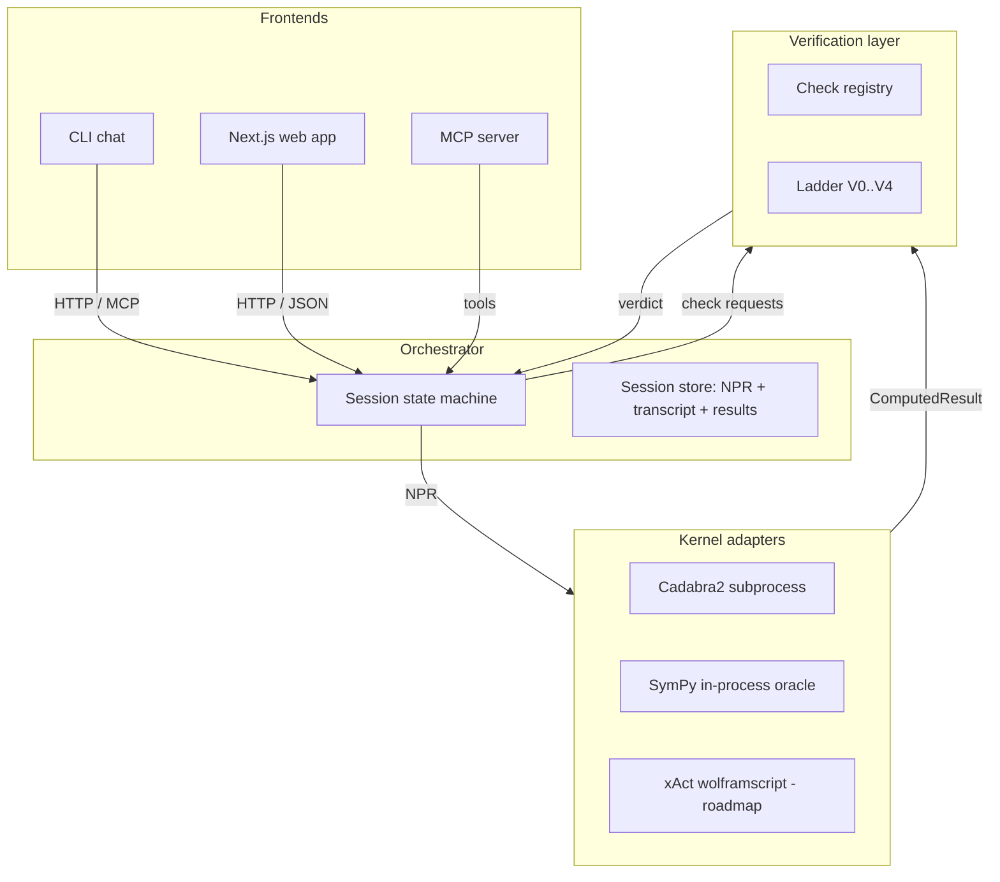
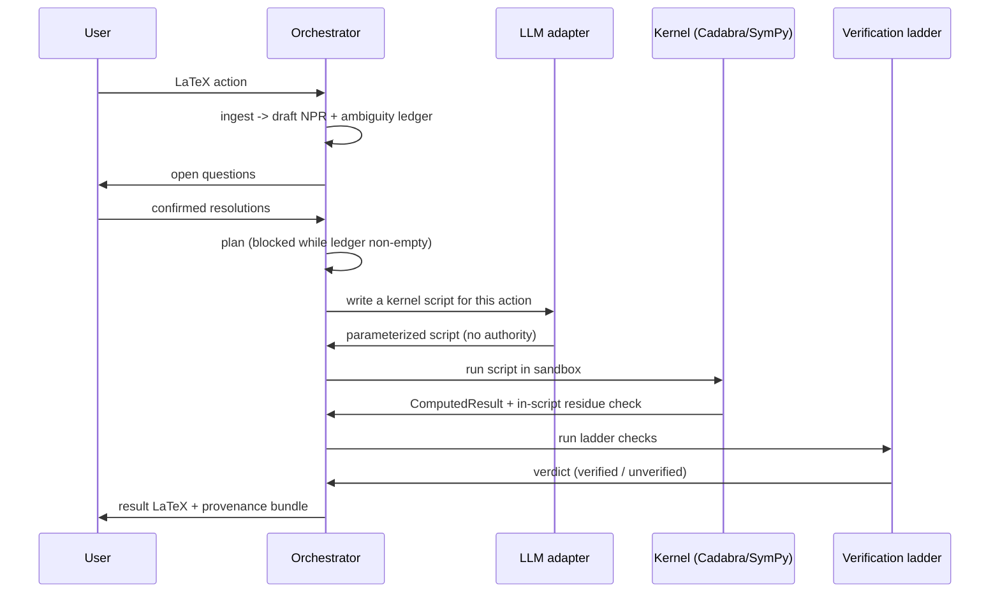

# Architecture

Noether has four layers separated by two hard boundaries. The layers are the frontends, the orchestrator, the kernel adapters, and the verification layer. The two boundaries are the NPR boundary (the only language crossing from orchestrator to kernels) and the provenance boundary (only kernel output reaches a result).

## The four layers

- **Frontends** are thin. The CLI, the Next.js web app, and the MCP server all talk to the orchestrator over HTTP or MCP tool calls. No physics runs client-side. See [Surfaces](../apps/index.md).
- **The orchestrator** (FastAPI, Python) runs the session state machine `INGEST -> ELICIT -> PLAN -> COMPUTE -> VERIFY -> PRESENT` and holds the session store. See [Orchestrator](../systems/orchestrator.md).
- **Kernel adapters** are the only code allowed to speak a CAS dialect. The planner picks kernels by capability, never by name. See [Kernels](../systems/kernels/index.md).
- **The verification layer** wraps every answer in a ladder of checks. See [Verification](../systems/verification.md).

## The two hard boundaries

### The NPR boundary

The Noether Problem Representation (NPR) is the backend-agnostic contract between "what the physicist meant" and "what any kernel executes". It is a versioned, diffable pydantic schema. The orchestrator never emits kernel syntax into results, and kernels never see raw user LaTeX. This is what keeps the system from locking into a single CAS. See [NPR](../systems/npr.md) and [Expression AST](../primitives/expression-ast.md).

### The provenance boundary

Only a `run_kernel` output can land in a result bundle. The model orchestrates and can write a kernel script, but the script carries no authority: a result is trusted only after a kernel's own check confirms it. The `verified` flag is set by the kernel, not by the model. This makes the "no unearned assertions" principle mechanical, not merely a guideline. See [Computed results and provenance](../primitives/computed-result.md).

## Data flow through a derivation

The LLM writes a script; it never writes an answer. The kernel computes and checks; the ladder confirms. The word "verified" means a check computed by a kernel passed, not that the model was confident.

## The verification ladder and the dual gate

The ladder has five rungs: V0 well-formedness, V1 structural invariants, V2 identity checks, V3 limiting cases, V4 independent recomputation. "I checked it three ways and it holds" means V2 plus V3 plus V4 are green.

For a metric-affine result, the SymPy general-connection oracle runs as an independent cross-check on explicit random metric and connection backgrounds. The result is called verified only when the Cadabra residue check and the SymPy cross-check agree. This dual gate is what catches the "torsion trap", where a Levi-Civita shortcut silently drops a torsion term and still reports a zero residue. See [Verification](../systems/verification.md) and [the dual gate rationale](../background/design-decisions.md).

## Language and stack

- **Backend**: Python 3.12+, full type annotations, `pydantic` v2 for the NPR schema, `sympy` for the in-process kernel, `fastapi` + `uvicorn` for the HTTP surface, `mcp` for the stdio server.
- **CAS**: Cadabra2 driven as a sandboxed subprocess (pinned `2.5.15`); SymPy pinned to the `1.14` series.
- **Frontend**: Next.js (App Router) + React 19 + KaTeX, TypeScript. See [Web frontend](../apps/web-frontend.md).

Full detail lives in `docs/02_TECH_SPEC.md`.
