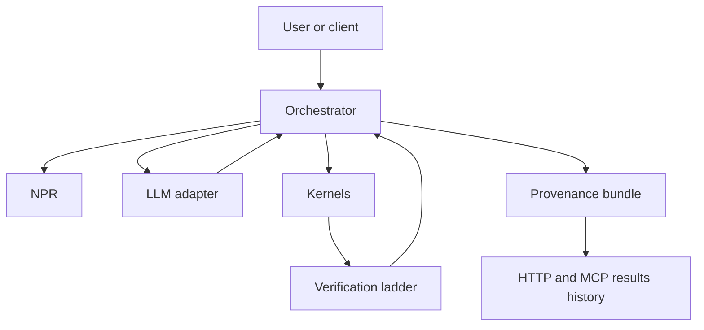

# Systems index

Active contributors: KeigoShimadaCC

## Purpose

Map the internal building blocks that turn an input action into a verified derivation with full provenance.

## Key subsystems

| Subsystem | Responsibility | Primary page | Primary code |
| --- | --- | --- | --- |
| NPR | Canonical, backend-agnostic problem contract | [NPR](./npr.md) | `noether/npr/` |
| Orchestrator | Session state machine and ambiguity gate | [Orchestrator](./orchestrator.md) | `noether/orchestrator/` |
| Kernels | Execute symbolic math and emit computed artifacts | [Kernels](./kernels/index.md) | `noether/kernels/` |
| Verification | Run check ladder and aggregate verdicts | [Verification](./verification.md) | `noether/verify/` |
| Provenance | Persist derivation bundles and reload history | [Provenance](./provenance.md) | `noether/provenance/` |
| LLM adapters | Provide prompt-to-text model IO only | [LLM adapters](./llm.md) | `noether/llm/` |

## How they fit

Noether keeps frontends thin and pushes all physics-bearing work into kernels plus checks. The orchestrator moves a session through `INGEST -> ELICIT -> PLAN -> COMPUTE -> VERIFY -> PRESENT`, blocks plan/compute while ambiguities are unresolved, and only publishes outputs that came from kernel computation and passed the configured checks.

## Integration points

- Architecture overview: [../overview/architecture.md](../overview/architecture.md)
- Shared terms: [../overview/glossary.md](../overview/glossary.md)
- Kernel internals: [./kernels/index.md](./kernels/index.md)
- Orchestrator internals: [./orchestrator.md](./orchestrator.md)
- Design rationale for verification gates: [../background/design-decisions.md](../background/design-decisions.md)

## Entry points for modification

- Add or evolve schema and parsing behavior in `noether/npr/`.
- Change session gating and derivation flow in `noether/orchestrator/`.
- Add kernel capability in `noether/kernels/` adapters only.
- Add checks in `noether/verify/checks.py` and compose in ladder usage sites.
- Extend bundle schema/layout in `noether/provenance/bundle.py`.
- Add new model transport in `noether/llm/` while preserving no-authority boundaries.

## Key source files

| File | Role |
| --- | --- |
| `noether/npr/__init__.py` | NPR exports and boundary contract |
| `noether/orchestrator/derive.py` | Derivation flow and result assembly |
| `noether/verify/__init__.py` | Verification exports |
| `noether/provenance/bundle.py` | Bundle write/read implementation |
| `noether/llm/__init__.py` | LLM adapter exports |
