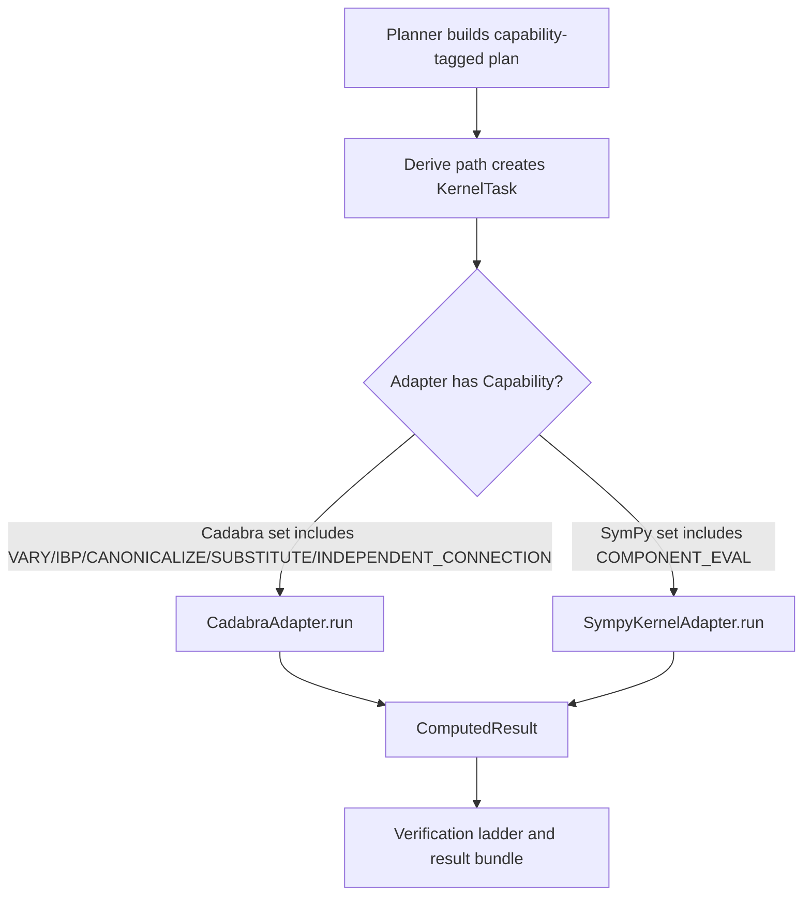

# Kernels

Active contributors: KeigoShimadaCC

## Purpose

Document the kernel adapter subsystem in `noether/kernels/`: the contract every kernel implements, how adapters are selected by `Capability`, and where to extend the subsystem without breaking the NPR and provenance boundaries.

## Directory layout

```text
noether/kernels/
├── __init__.py
├── base.py
├── versions.py
├── cadabra/
│   ├── __init__.py
│   ├── adapter.py
│   ├── templates.py
│   ├── blocks.py
│   ├── generate.py
│   ├── curvature.py
│   └── horndeski_g4g5.py
└── sympy_kernel/
    ├── __init__.py
    ├── adapter.py
    ├── evaluator.py
    ├── geometry.py
    ├── adm.py
    ├── ft_tetrad.py
    ├── fq_coincident.py
    └── linearized.py
```

## Key abstractions

| Type | File | Description |
|---|---|---|
| `Capability` | `noether/kernels/base.py` | Kernel feature tags: `VARY`, `IBP`, `CANONICALIZE`, `SUBSTITUTE`, `PERTURB`, `ADM`, `COMPONENT_EVAL`, `INDEPENDENT_CONNECTION`. |
| `KernelTask` | `noether/kernels/base.py` | One capability-tagged request (`capability`, `description`, `payload`). |
| `KernelScript` | `noether/kernels/base.py` | Executed script receipt (`kernel_name`, `language`, `source`). |
| `KernelRawOutput` | `noether/kernels/base.py` | Raw run capture (`stdout`, `stderr`, `returncode`, `duration_s`). |
| `ComputedResult` | `noether/kernels/base.py` | Kernel-computed result plus script and raw output provenance. |
| `KernelAdapter` | `noether/kernels/base.py` | Adapter protocol: `available()`, `version()`, `capabilities()`, `run()`. |
| `KernelUnavailable` | `noether/kernels/base.py` | Raised when a backend engine is not installed or callable. |

## How it works



- The planner emits capability-tagged steps (`noether/orchestrator/planner.py`), not adapter names.
- The derive path chooses task capability from context, for example `PERTURB` for perturbations and `INDEPENDENT_CONNECTION` for connection variation (`noether/orchestrator/derive.py`).
- Verification checks that need component evaluation select whichever available adapter exposes `Capability.COMPONENT_EVAL` (`_component_kernel` in `noether/verify/checks.py`).

## Adapter selection contract

Selection is by `Capability`, never by kernel brand:

- Cadabra exposes `{VARY, IBP, CANONICALIZE, SUBSTITUTE, INDEPENDENT_CONNECTION}`.
- SymPy exposes `{COMPONENT_EVAL}`.

This keeps orchestrator and verification code backend-agnostic at the interface level and makes backend swaps additive.

## Version pinning

Pins live in one file: `noether/kernels/versions.py`.

- `SYMPY_PINNED = "1.14"`
- `CADABRA_PINNED = "2.5.15"`

`sympy_matches_pin()` checks the installed SymPy major.minor against the pin.

## Integration points

- Planning and derive execution: `noether/orchestrator/planner.py`, `noether/orchestrator/derive.py`
- Verification ladder checks: `noether/verify/checks.py`, `noether/verify/ladder.py`
- Runtime surfaces wiring adapters: `noether/server/app.py`, `noether/mcp/server.py`, `noether/cli/main.py`

## Entry points for modification

1. Add or change capabilities in `noether/kernels/base.py`.
2. Update adapter `capabilities()` and `run()` implementations.
3. Wire new behavior through planner and derive paths.
4. Keep version pins centralized in `noether/kernels/versions.py`.

## Sub-pages

- [Cadabra2 adapter](./cadabra.md)
- [SymPy oracle](./sympy.md)

## Related pages

- [Architecture](../../overview/architecture.md)
- [Verification](../verification.md)
- [Orchestrator](../orchestrator.md)
- [Computed results and provenance](../../primitives/computed-result.md)
- [Conventions](../../primitives/conventions.md)
- [Equations of motion](../../features/equations-of-motion.md)
- [Teleparallel](../../features/teleparallel.md)
- [ADM decomposition](../../features/adm-decomposition.md)

## Key source files

| File | Role |
|---|---|
| `noether/kernels/base.py` | Contract and core result/provenance types. |
| `noether/kernels/__init__.py` | Public kernel adapter exports. |
| `noether/kernels/versions.py` | Single source of truth for pinned kernel versions. |
| `noether/orchestrator/planner.py` | Capability-tagged planning DAG. |
| `noether/orchestrator/derive.py` | Runtime capability choice and adapter task dispatch. |
| `noether/verify/checks.py` | Capability-based component-check adapter selection. |
