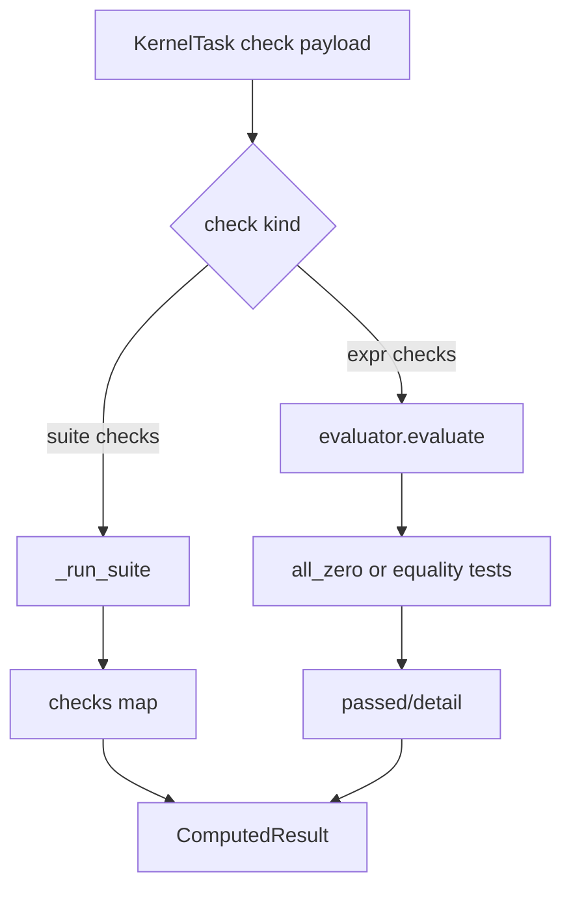

# SymPy oracle

Active contributors: KeigoShimadaCC

## Purpose

Document `noether/kernels/sympy_kernel/` as the in-process component oracle: it evaluates tensor expressions on explicit backgrounds, runs independent cross-check suites, and powers ADM and teleparallel component verification.

## Directory layout

```text
noether/kernels/sympy_kernel/
├── __init__.py
├── adapter.py
├── evaluator.py
├── geometry.py
├── adm.py
├── ft_tetrad.py
├── fq_coincident.py
└── linearized.py
```

## Key abstractions

| Type or function | File | Description |
|---|---|---|
| `SympyKernelAdapter` | `noether/kernels/sympy_kernel/adapter.py` | In-process adapter with `Capability.COMPONENT_EVAL`. |
| `_geometry_for()` | `noether/kernels/sympy_kernel/adapter.py` | Builds metric backgrounds from task specs (`random-diagonal`, `sparse-diagonal`, `two-sphere`, `warped-product-4d`). |
| `_fields_for()` | `noether/kernels/sympy_kernel/adapter.py` | Binds random scalar/covector/antisymmetric component fields for checks. |
| `_run_suite()` | `noether/kernels/sympy_kernel/adapter.py` | Runs named check suites and packages pass/fail map into `ComputedResult.value["checks"]`. |
| `evaluate()`, `all_zero()` | `noether/kernels/sympy_kernel/evaluator.py` | NPR AST component evaluation and exact zero testing on arrays/scalars. |
| `ComponentGeometry` | `noether/kernels/sympy_kernel/geometry.py` | Levi-Civita and general-connection geometric primitives (`R`, `Ricci`, `Einstein`, torsion/non-metricity, projective shifts). |
| `ADMGeometry`, `AffineADMGeometry` | `noether/kernels/sympy_kernel/adm.py` | ADM split and metric-affine ADM component verification suites. |
| `spectrum_checks()` | `noether/kernels/sympy_kernel/linearized.py` | Linearized scalar-tensor spectrum checks around Minkowski. |
| `ft_*` helpers | `noether/kernels/sympy_kernel/ft_tetrad.py` | f(T) tetrad/Weitzenbock geometry and EOM component checks. |
| `fQ_*` helpers | `noether/kernels/sympy_kernel/fq_coincident.py` | Coincident-gauge f(Q) identities and EOM component checks. |

## How it works



## Supported check families

`adapter.py` supports:

- Expression checks on explicit metrics: `zero`, `symmetric`, `divergence-zero`, `equal`
- Projective and Palatini checks: `palatini-projective-inert`, `palatini-ricci-shift-is-dA`, `palatini-projective-inert-general`
- ADM suites: `adm-gr-1p2`, `adm-affine-1p2`, `adm-affine-matter-1p2`
- Linearized suite: `spectrum-scalar-tensor-minkowski`

Each run returns a reproduction script in `KernelScript.source` so the exact component test can be rerun.

## Capability and role in the dual gate

`SympyKernelAdapter.capabilities()` returns only:

- `Capability.COMPONENT_EVAL`

This adapter is the independent oracle side of the dual gate: Cadabra residue checks symbolic derivations, and SymPy component checks independently falsify incorrect identities on concrete backgrounds.

## Integration points

- Verification checks pick the first available adapter with `COMPONENT_EVAL` in `noether/verify/checks.py`.
- Derive paths call SymPy checks for ADM and other component-validated flows in `noether/orchestrator/derive.py`.
- Teleparallel and metric-affine feature paths rely on `geometry.py`, `adm.py`, `ft_tetrad.py`, and `fq_coincident.py`.

## Entry points for modification

1. Add a new `check` branch in `noether/kernels/sympy_kernel/adapter.py`.
2. Add reusable geometry primitives in `noether/kernels/sympy_kernel/geometry.py`.
3. Extend evaluator tensor vocabulary in `noether/kernels/sympy_kernel/evaluator.py`.
4. Add or update domain suites (`adm.py`, `linearized.py`, `ft_tetrad.py`, `fq_coincident.py`).
5. Keep capability surface stable unless planner and verification paths are updated together.

## Key source files

| File | Role |
|---|---|
| `noether/kernels/sympy_kernel/adapter.py` | COMPONENT_EVAL task dispatcher and result packager. |
| `noether/kernels/sympy_kernel/evaluator.py` | AST-to-components evaluator and zero-test routines. |
| `noether/kernels/sympy_kernel/geometry.py` | General-connection component geometry primitives (`1848` lines). |
| `noether/kernels/sympy_kernel/adm.py` | ADM and metric-affine ADM verification suites (`1291` lines). |
| `noether/kernels/sympy_kernel/linearized.py` | Linearized scalar-tensor spectrum check suite. |
| `noether/kernels/sympy_kernel/ft_tetrad.py` | f(T) tetrad and Weitzenbock checks. |
| `noether/kernels/sympy_kernel/fq_coincident.py` | Coincident-gauge f(Q) checks. |
| `noether/kernels/sympy_kernel/__init__.py` | SymPy adapter and geometry exports. |
