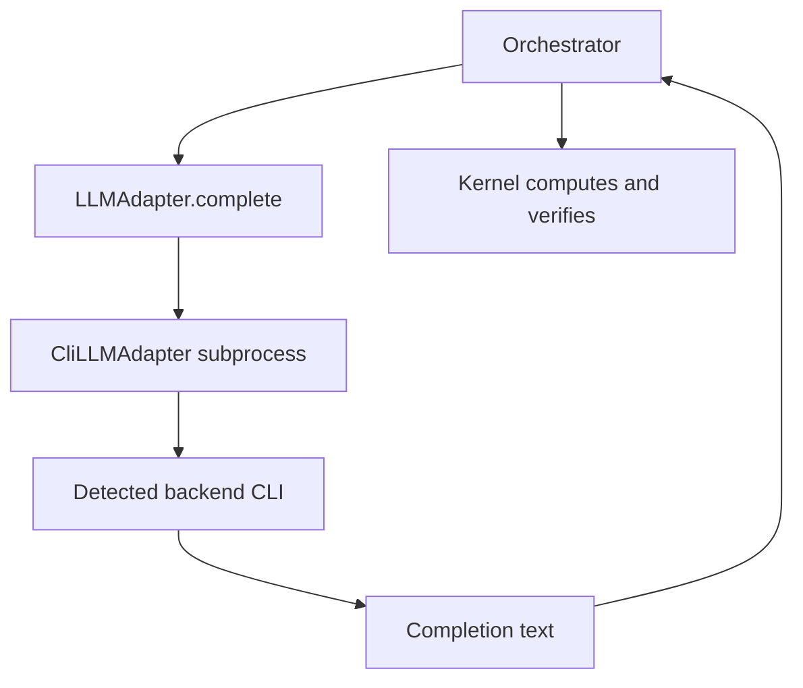

# LLM adapter system

Active contributors: KeigoShimadaCC

## Purpose

Describe the model adapter layer that supplies prompt-to-text completions while holding zero authority over computed physics results or ambiguity resolution.

## Directory layout

```text
noether/llm/
  __init__.py
  base.py
  cli.py
```

## Key abstractions

| Abstraction | Defined in | Role |
| --- | --- | --- |
| `LLMAdapter` (`Protocol`) | `noether/llm/base.py` | Minimal contract: `available()`, `version()`, `complete(system, prompt)` |
| `LLMError` | `noether/llm/base.py` | Adapter transport/runtime error type |
| `StubLLMAdapter` | `noether/llm/base.py` | Deterministic in-process test adapter returning fixed replies |
| `stub_reply()` | `noether/llm/base.py` | Helper to generate expected structured model reply JSON for tests |
| `CliBackend` | `noether/llm/cli.py` | Backend descriptor (`name`, executable, version args, prompt flags) |
| `KNOWN_BACKENDS` | `noether/llm/cli.py` | Ambient-auth detection order: `codex`, `claude`, `gemini`, `droid` |
| `CliLLMAdapter` | `noether/llm/cli.py` | One-shot subprocess wrapper for an already-authenticated local model CLI |

## How it works

`CliLLMAdapter` auto-detects installed CLIs from `KNOWN_BACKENDS` using `shutil.which`. It then runs one-shot subprocess commands with backend-specific flags and returns stdout as completion text. Authentication stays in each CLI login session. No API keys are loaded from Noether config for this adapter path.

The adapter is transport only. Per `base.py` docs, it cannot inject computed expressions into results and cannot resolve ambiguities on its own.



## Integration points

- Orchestrator derivation/planning flow: [./orchestrator.md](./orchestrator.md)
- Ingest and elicitation behavior using model proposals: [../features/ingest.md](../features/ingest.md)
- Architecture boundaries and authority model: [../overview/architecture.md](../overview/architecture.md)

## Entry points for modification

- Add adapter contract methods only with boundary review in `noether/llm/base.py`.
- Add/update backend definitions in `KNOWN_BACKENDS` (`noether/llm/cli.py`).
- Adjust CLI invocation policy and timeout handling in `CliLLMAdapter.complete()`.
- Keep exported surface updated in `noether/llm/__init__.py`.

## Key source files

| File | Role |
| --- | --- |
| `noether/llm/base.py` | Adapter protocol, stub adapter, stub response helper, no-authority contract |
| `noether/llm/cli.py` | Ambient-auth CLI adapter and backend detection/invocation |
| `noether/llm/__init__.py` | Public exports for LLM adapters and backend metadata |
