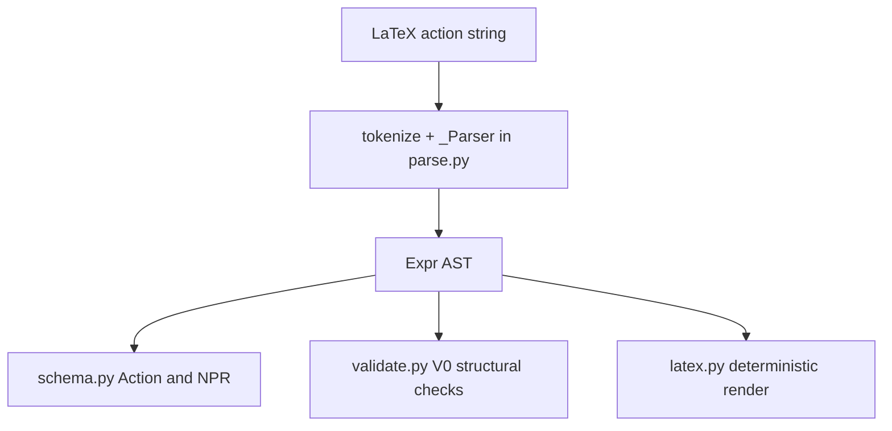

# NPR system

Active contributors: KeigoShimadaCC

## Purpose

Describe the Noether Problem Representation (NPR) system that standardizes input physics into a typed, backend-agnostic contract used by orchestration, kernels, and verification.

## Directory layout

```text
noether/npr/
  __init__.py
  schema.py
  parse.py
  latex.py
  validate.py
  ast.py
  conventions.py
```

## Key abstractions

| Abstraction | Defined in | Role |
| --- | --- | --- |
| `NPR` | `noether/npr/schema.py` | Top-level versioned object: conventions, geometry, objects, action, task, ambiguities |
| `ObjectDecl` | `noether/npr/schema.py` | Declared entities with kind/role/symmetry/rank metadata |
| `Geometry` + `ConnectionSpec` | `noether/npr/schema.py` | Connection family and geometric assumptions (Levi-Civita vs independent, torsion/non-metricity flags) |
| `Action` | `noether/npr/schema.py` | Measure plus parsed Lagrangian `Expr` |
| `Task` | `noether/npr/schema.py` | Requested operation (`vary`, `perturb`, `adm`, etc.) and targets |
| `Ambiguity` | `noether/npr/schema.py` | Explicit question ledger with on-menu options and optional resolution |
| `NPR.unresolved_ambiguities()` | `noether/npr/schema.py` | Returns unresolved ledger entries |
| `NPR.is_well_posed()` | `noether/npr/schema.py` | True only when no unresolved ambiguity remains |

Deep atomic primitives are documented separately and should not be duplicated here:
- Convention block: [../primitives/conventions.md](../primitives/conventions.md)
- Expression nodes: [../primitives/expression-ast.md](../primitives/expression-ast.md)

## How it works

`parse.py` is a deterministic syntactic parser from LaTeX subset to `Expr`. It does not infer physical intent, field roles, or conventions. It tokenizes, parses grouped/indexed structures, and builds typed AST nodes (`Num`, `Sym`, `Func`, `Tensor`, `Deriv`, `Pow`, `Prod`, `Sum`) that become `NPR.action.lagrangian`.

Structural checks in `validate.py` enforce V0 index correctness:
- contraction rules within products (no same-variance repeats, no malformed multiplicity),
- free-index agreement across sums,
- optional `expected_free` matching.

`latex.py` provides deterministic rendering (`render(expr)`) so the same AST returns byte-stable LaTeX output.



## Integration points

- Ingest flow that calls parser and seeds ambiguity ledger: [../features/ingest.md](../features/ingest.md)
- Orchestrator lifecycle and gating: [./orchestrator.md](./orchestrator.md)
- Kernel boundary using NPR only: [./kernels/index.md](./kernels/index.md)
- Architecture context: [../overview/architecture.md](../overview/architecture.md)

## Entry points for modification

- Extend NPR fields or constraints in `noether/npr/schema.py`.
- Extend parser grammar in `noether/npr/parse.py` (public entry points: `parse_action`, `parse_lagrangian`).
- Adjust deterministic rendering in `noether/npr/latex.py`.
- Tighten or expand structural V0 checks in `noether/npr/validate.py`.
- Keep exports aligned in `noether/npr/__init__.py`.

## Key source files

| File | Role |
| --- | --- |
| `noether/npr/schema.py` | Core schema (`NPR`, `ObjectDecl`, `Geometry`, `ConnectionSpec`, `Action`, `Task`, `Ambiguity`) |
| `noether/npr/parse.py` | LaTeX parser (~504 lines), syntactic front door |
| `noether/npr/latex.py` | Deterministic AST-to-LaTeX renderer |
| `noether/npr/validate.py` | Structural index-balance and free-index validation (V0) |
| `noether/npr/__init__.py` | Public NPR exports used outside `noether/npr` |
