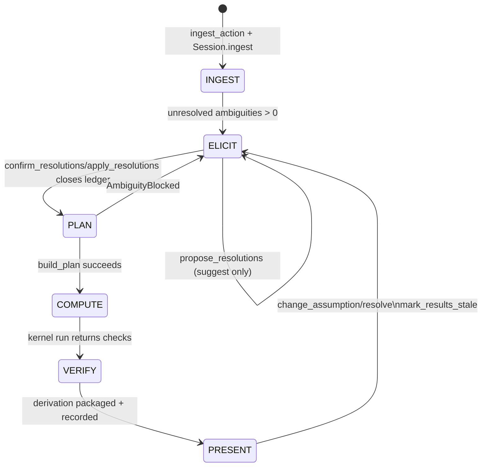

# Orchestrator
Active contributors: KeigoShimadaCC

## Purpose

The orchestrator in `noether/orchestrator/` is the deterministic control plane for Project Noether sessions. It owns the session state machine, blocks planning until ambiguities are resolved, and coordinates ingest, elicitation, definitions, derivation, and persistence.

Two guarantees are enforced structurally:

- No silent guessing: `build_plan` raises `AmbiguityBlocked` while the ambiguity ledger is non-empty.
- No unearned assertions: derive paths trust results only when kernel checks pass, and `verified` comes from kernel output.

The model has two bounded roles only:

1. Propose answers during elicitation.
2. Write kernel scripts during general derivation.

It does not mutate NPR state on its own and does not set verification verdicts.

## Directory layout

```text
noether/orchestrator/
├── __init__.py        # Public exports for ingest/elicit/plan/session
├── session.py         # Session state machine + immutable NPR history
├── planner.py         # Deterministic task plans + ambiguity gate
├── ingest.py          # LaTeX action -> draft NPR + open ambiguity ledger
├── elicit.py          # Model proposals + validated human-confirmed apply path
├── definitions.py     # Readability shorthand proposals/adoption helpers
├── derive.py          # Compute + verification verdict plumbing + provenance write
├── resolutions.py     # Map confirmed ledger answers into NPR fields/conventions
├── store.py           # Atomic JSON session persistence
└── view.py            # Frontend-neutral payload shaping for sessions/results
```

## Key abstractions

| Type or symbol | File | Description |
| --- | --- | --- |
| `SessionState` (`INGEST`, `ELICIT`, `PLAN`, `COMPUTE`, `VERIFY`, `PRESENT`) | `noether/orchestrator/session.py` | Canonical session phases. |
| `Session` | `noether/orchestrator/session.py` | State machine and immutable `npr_versions` append-only history, plus stale result tracking. |
| `Plan`, `PlanStep` | `noether/orchestrator/planner.py` | Deterministic capability-tagged step DAG for `vary`, `adm`, and `perturb`. |
| `AmbiguityBlocked` | `noether/orchestrator/planner.py` | Hard stop raised when unresolved ambiguities remain. |
| `IngestResult` | `noether/orchestrator/ingest.py` | Parsed action + draft NPR + initial question set. |
| `ElicitationProposal`, `ProposedResolution` | `noether/orchestrator/elicit.py` | Unconfirmed model suggestions for open ambiguities. |
| `apply_resolutions(...)` | `noether/orchestrator/elicit.py` | Applies only human-confirmed on-menu choices to a copied NPR. |
| `propagate_resolution(...)` | `noether/orchestrator/resolutions.py` | Makes confirmed choices effective in task/conventions/geometry fields. |
| `DefinitionProposal` | `noether/orchestrator/definitions.py` | Notation-only shorthand proposal (`F_phi`, `K(T)`, `L(Q)`, `Q`, etc.). |
| `FieldDerivation` | `noether/orchestrator/derive.py` | Per-field derivation payload with kernel verdict, checks, detail, teaching, conventions. |

## How it works

### Session state machine and ambiguity gate



Key deterministic rules:

- `Session.npr_versions` is immutable append-only. Every ingest/resolve/confirm/definition/assumption-change appends a new NPR snapshot.
- `build_plan(...)` is model-independent and refuses to continue while any ambiguity is unresolved.
- Any assumption change transitions back to `ELICIT` and marks previously recorded results stale instead of silently dropping them.

### Derive pipeline (compute beat)

```mermaid
flowchart TD
    A[Well-posed NPR] --> B[build_plan gate]
    B --> C{kind}
    C -->|vary| D[derive_eom]
    C -->|perturb| E[derive_perturbation]
    C -->|adm| F[derive_adm]

    D --> G[derive_field]
    E --> G
    G --> H{Path}
    H -->|compositional or template| I[Cadabra/SymPy kernel run]
    H -->|general| J[LLM writes script only]
    J --> I
    I --> K[Read kernel checks]
    K --> L[Set verified from checks only]
    L --> M[Create FieldDerivation\n(detail required non-empty)]
    M --> N[write_bundle provenance]
```

Execution specifics:

- `derive_field(...)` calls `build_plan(...)` first, so compute never bypasses the ambiguity gate.
- Capability routing is deterministic: connection variation uses `Capability.INDEPENDENT_CONNECTION`.
- `FieldDerivation.detail` is structurally required to be non-empty via `@model_validator`.
- `teaching` is a separate reasoned prose channel and does not change NPR or kernel verdict.
- `write_bundle(...)` persists provenance for both verified and gated outputs.

## Integration points

- **NPR boundary:** orchestrator consumes and mutates only `NPR` (`noether/npr/schema.py`), keeping kernel adapters backend-agnostic.
- **Kernel adapters:** planner steps are capability-based. See `../systems/kernels/index.md`.
- **Verification semantics:** derive paths interpret kernel checks into `verified` and ladder reports. See `../systems/verification.md`.
- **Feature surfaces:** ingest/elicit/derive behaviors are consumed by higher-level feature flows:
  - `../features/ingest.md`
  - `../features/elicitation.md`
  - `../features/equations-of-motion.md`
  - `../features/perturbation.md`
  - `../features/adm-decomposition.md`
  - `../features/teaching-channel.md`
- **Persistence and replay:** result history is read via provenance bundles and exposed through neutral payload shapes. See `../primitives/computed-result.md` and `../systems/provenance.md`.
- **Architecture context:** the cross-layer sequence is documented in `../overview/architecture.md`.

## Entry points for modification

1. **Session semantics:** update `noether/orchestrator/session.py` for state transitions, immutable versioning rules, or stale result policy.
2. **Planning behavior:** update `noether/orchestrator/planner.py` for task templates, capability steps, or verification requirements.
3. **Ingest heuristics and ambiguity generation:** update `noether/orchestrator/ingest.py`.
4. **Elicitation contract:** update `noether/orchestrator/elicit.py` for proposal parsing/validation or AST cue handling (`UnhandledASTNodeError` is fail-loud by design).
5. **Resolution propagation:** update `noether/orchestrator/resolutions.py` when new ambiguity IDs must mutate geometry/task/convention fields.
6. **Readability shorthands:** update `noether/orchestrator/definitions.py` for notation proposals.
7. **Derivation orchestration:** update `noether/orchestrator/derive.py` for path routing and output packaging, while preserving kernel-authoritative verification.
8. **Persistence and views:** update `noether/orchestrator/store.py` and `noether/orchestrator/view.py`.

## Key source files

| File | Primary responsibility | Notes |
| --- | --- | --- |
| `noether/orchestrator/__init__.py` | Public orchestrator API exports | Explicitly states deterministic machine and ambiguity gate are model-independent. |
| `noether/orchestrator/session.py` | State machine and NPR version history | `ingest`, `resolve`, `confirm_resolutions`, `add_definition`, `change_assumption`, `plan`, `record_result`, `mark_results_stale`. |
| `noether/orchestrator/planner.py` | Plan construction and gating | Inserts `INDEPENDENT_CONNECTION` step for independent connection in `vary` plans. |
| `noether/orchestrator/ingest.py` | Parse action into draft NPR + questions | Adds `Gamma` connection object when explicit connection is present in the action. |
| `noether/orchestrator/elicit.py` | Suggest-only model proposals + strict apply path | Off-menu model suggestions are nulled; only confirmed on-menu answers mutate NPR. |
| `noether/orchestrator/definitions.py` | Notation proposal system | Adds shorthand symbols only, not physics results. |
| `noether/orchestrator/derive.py` | Compute orchestration and provenance | Refuses non-well-posed input, routes path, sets `verified` from kernel checks, writes bundles. |
| `noether/orchestrator/resolutions.py` | Resolution-to-NPR propagation | Keeps task fields and geometry/convention fields in sync with confirmed ambiguity answers. |
| `noether/orchestrator/store.py` | Session persistence | Atomic JSON replace per session id. |
| `noether/orchestrator/view.py` | Surface-neutral payload shaping | Returns session/results payloads without mutating physics state. |
