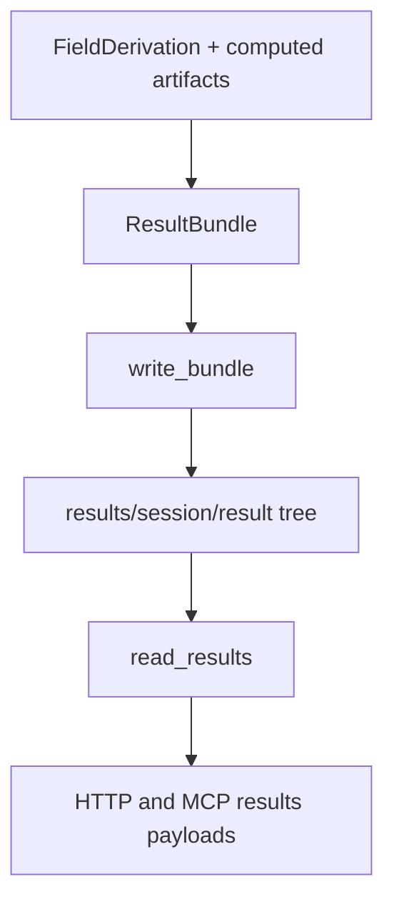

# Provenance bundle system

Active contributors: KeigoShimadaCC

## Purpose

Document how Noether persists derivation artifacts to result bundles and reloads them consistently for history views.

## Directory layout

```text
noether/provenance/
  __init__.py
  bundle.py
```

Bundle layout on disk:

```text
results/<session-id>/<result-id>/
  result.json
  assumptions.json
  plan.json
  checks.json
  derivations.json
  scripts/
  raw/
  narrative.md
```

## Key abstractions

| Abstraction | Defined in | Role |
| --- | --- | --- |
| `ResultBundle` | `noether/provenance/bundle.py` | Persisted record tying NPR snapshot, computed artifacts, checks, and rendered derivations |
| `write_bundle()` | `noether/provenance/bundle.py` | Writes full bundle directory and all JSON/text/script artifacts |
| `read_results()` | `noether/provenance/bundle.py` | Reloads derivation dicts from `derivations.json` for ordered session history |

## How it works

`write_bundle()` materializes a deterministic directory tree per result id:
- writes summary files (`result.json`, `assumptions.json`, `plan.json`, `checks.json`, `derivations.json`),
- stores kernel scripts under `scripts/` with extension by language (`.cdb`, `.py`, `.wl`, fallback `.txt`),
- stores raw kernel transport output under `raw/`,
- writes provenance narrative text to `narrative.md`.

`read_results()` is history-oriented. For each recorded `result_id`, it tries to read `derivations.json` and extends the output list only with valid dict entries. Missing or unreadable bundles are skipped rather than failing the full history fetch.



## Narrative vs teaching

`ResultBundle.narrative` and `FieldDerivation.teaching` are intentionally different:
- `narrative` (`narrative.md`) records what was computed, by which kernel path, and which checks passed.
- `teaching` is a derivation-level explanatory channel about geometry tradeoffs.

They serve different contracts and should not be merged.

## Integration points

- Session result payload reloading: `noether/orchestrator/view.py` (`results_payload`)
- HTTP results endpoint: `noether/server/app.py` (`GET /sessions/{session_id}/results`)
- MCP results tool: `noether/mcp/server.py` (`noether_results`)
- Computed artifact model: [../primitives/computed-result.md](../primitives/computed-result.md)

## Entry points for modification

- Extend persisted fields in `ResultBundle` in `noether/provenance/bundle.py`.
- Adjust on-disk layout and serializers in `write_bundle()`.
- Adjust tolerance policy in `read_results()` (currently skip-on-missing/unreadable).
- Keep exports in `noether/provenance/__init__.py` aligned with any API changes.

## Key source files

| File | Role |
| --- | --- |
| `noether/provenance/bundle.py` | Bundle schema, write path, readback path |
| `noether/provenance/__init__.py` | Public provenance exports |
| `noether/orchestrator/view.py` | Frontend-neutral history payload using `read_results()` |
| `noether/server/app.py` | HTTP endpoint surfacing bundle-backed history |
| `noether/mcp/server.py` | MCP tool surfacing the same history data |
