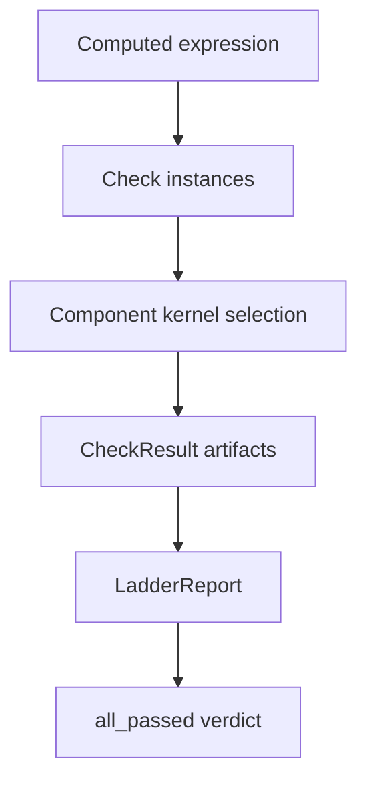

# Verification system

Active contributors: KeigoShimadaCC

## Purpose

Explain how Noether evaluates computed derivations with a check registry and ladder reports, and how metric-affine paths use a dual gate to avoid torsion-related false positives.

## Directory layout

```text
noether/verify/
  __init__.py
  checks.py
  ladder.py
```

## Key abstractions

| Abstraction | Defined in | Role |
| --- | --- | --- |
| `CheckResult` | `noether/verify/checks.py` | Normalized check output with `name`, `rung`, `passed`, `detail`, `computed_by`, and `artifacts` |
| `WellFormedCheck` | `noether/verify/checks.py` | V0 structural check using `validate_expression` |
| `SymmetricCheck` | `noether/verify/checks.py` | V1 rank-2 symmetry spot-check on explicit backgrounds |
| `DivergenceFreeCheck` | `noether/verify/checks.py` | V2 divergence identity check on explicit backgrounds |
| `EqualOnBackgroundCheck` | `noether/verify/checks.py` | V3 equality check for two expressions on explicit backgrounds |
| `_component_kernel()` | `noether/verify/checks.py` | Selects first available adapter with `Capability.COMPONENT_EVAL` |
| `DEFAULT_METRIC_SPECS` | `noether/verify/checks.py` | Default random background specs (`seed=7`, `seed=23`, `dim=4`) |
| `LadderReport` | `noether/verify/ladder.py` | Ordered report with `all_passed` and text summary |
| `run_ladder()` | `noether/verify/ladder.py` | Executes checks in sequence and returns `LadderReport` |

## The five rungs (V0..V4)

| Rung | Meaning | Current implementation anchor |
| --- | --- | --- |
| V0 | Structural well-formedness | `WellFormedCheck` via `noether/npr/validate.py` |
| V1 | Structural invariants | `SymmetricCheck` |
| V2 | Identity checks | `DivergenceFreeCheck` and component-eval identities |
| V3 | Limiting/background checks | `EqualOnBackgroundCheck` and kernel residue-equality checks |
| V4 | Independent recomputation | Independent kernel/oracle recomputation before final trust |

## How it works

`checks.py` defines reusable check objects. Component checks inherit shared logic (`_ComponentCheck`) that runs each check against each background in `DEFAULT_METRIC_SPECS` using the selected component kernel and accumulates artifacts.

`ladder.py` composes these checks into a `LadderReport`. A derivation is considered ladder-green only when `LadderReport.all_passed` is true.



## Dual gate for metric-affine paths

On metric-affine pathways, verification is intentionally not a single test. The effective gate is:

1. Cadabra residue-style consistency check must pass.
2. SymPy general-connection cross-check must agree on explicit non-Levi-Civita backgrounds.

The SymPy adapter exposes dedicated general-connection checks such as:
- `palatini-ricci-shift-is-dA`
- `palatini-projective-inert-general`

This dual gate is designed to catch the torsion trap described in kernel geometry comments: Levi-Civita-only identities can look valid while silently dropping torsion or non-metricity terms on general connections.

For rationale and examples, see:
- [../features/metric-affine-geometry.md](../features/metric-affine-geometry.md)
- [../background/design-decisions.md](../background/design-decisions.md)

## Integration points

- Derived outputs and per-result verdict metadata: [../primitives/computed-result.md](../primitives/computed-result.md)
- Orchestrator derivation flow: [./orchestrator.md](./orchestrator.md)
- Kernel capabilities: [./kernels/index.md](./kernels/index.md)
- High-level architecture: [../overview/architecture.md](../overview/architecture.md)

## Entry points for modification

- Add or modify checks in `noether/verify/checks.py`.
- Adjust ladder composition in callers that invoke `run_ladder()`.
- Extend background spec policy (`DEFAULT_METRIC_SPECS`) in `checks.py`.
- Keep package exports updated in `noether/verify/__init__.py`.

## Key source files

| File | Role |
| --- | --- |
| `noether/verify/checks.py` | Check registry and component-check execution scaffolding |
| `noether/verify/ladder.py` | Ladder execution and aggregate report |
| `noether/verify/__init__.py` | Public verify exports |
| `noether/kernels/sympy_kernel/adapter.py` | General-connection cross-check implementations used in dual-gate workflows |
